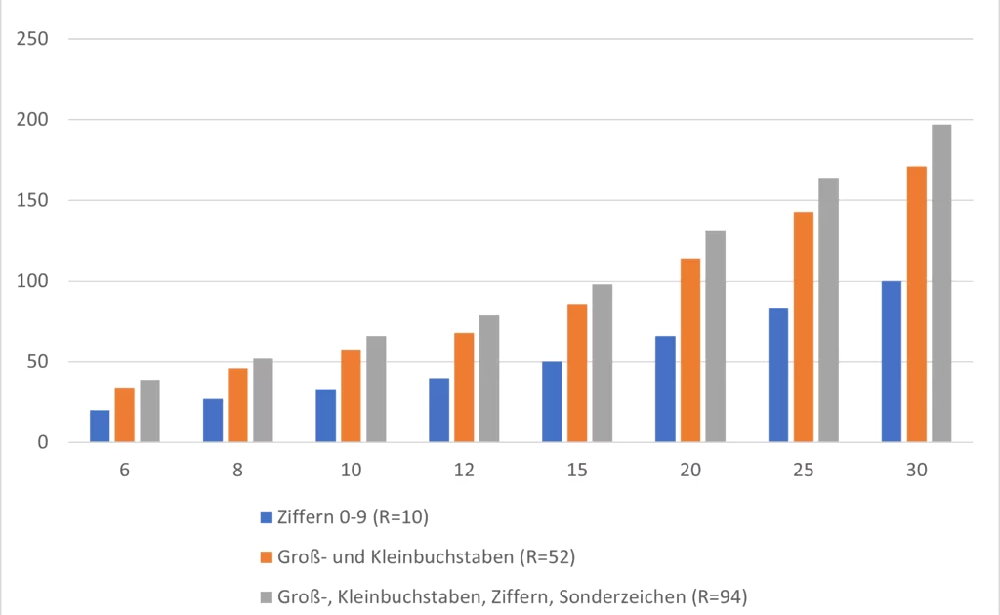
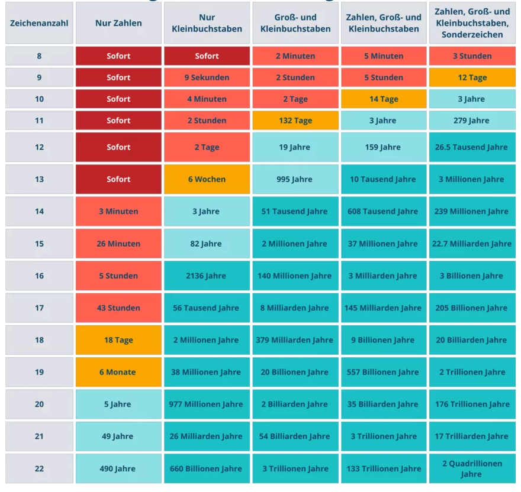
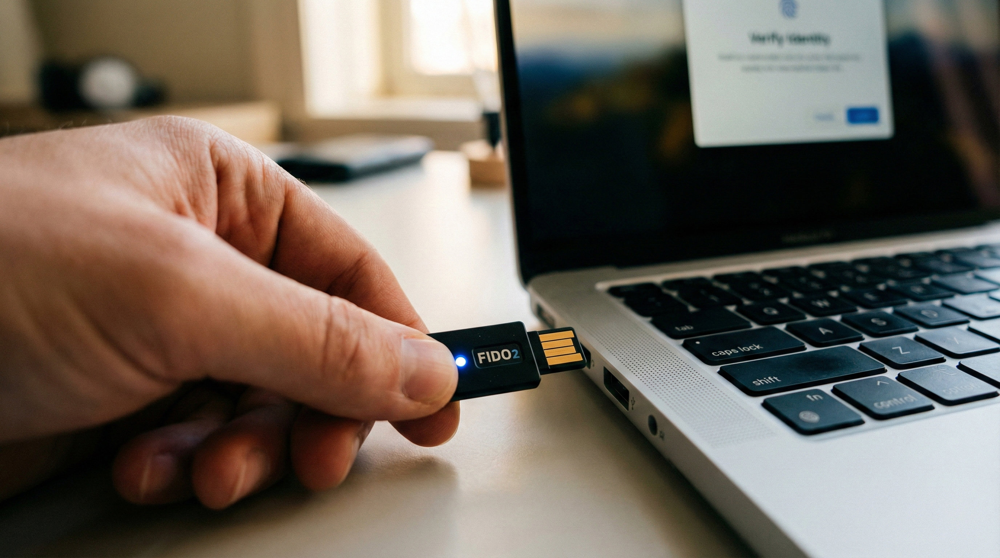

# Identity and Access Management (IAM)

## Authentifizierung und Autorisierung

---

# Agenda Identity & Access Management (IAM)

- Grundlagen: Authentifizierung vs. Autorisierung
- Drei Arten der Authentifizierung: Passwörter, Besitz, Sein
- 2-Faktor-Authentifizierung (2FA)
- Passkeys
- Berechtigungsmanagement
- Single Sign-On (SSO)

----

# Identity & Access Management (IAM)

IAM ist das Framework aus **Richtlinien, Prozessen und Technologien**, das sicherstellt, dass die **richtigen Entitäten** (Benutzer oder Systeme) den **richtigen Zugriff** auf die **richtigen Ressourcen** (Daten, Anwendungen) zur **richtigen Zeit** und aus den **richtigen Gründen** erhalten.

---

# Grundlagen: Authentifizierung vs. Autorisierung

- Authentifizierung (AuthN): Wer sind Sie?

  - Der Prozess der Überprüfung einer Identität.
  - Der Benutzer beweist, dass er derjenige ist, für den er sich ausgibt.
  - Analogie: Das Vorzeigen Ihres Personalausweises an der Tür.

---

# Grundlagen: Authentifizierung vs. Autorisierung

- Autorisierung (AuthZ): Was dürfen Sie tun?

  - Der Prozess der Gewährung oder Verweigerung von Rechten.
  - Dieser Schritt erfolgt nach einer erfolgreichen Authentifizierung.
  - Definiert, auf welche Ressourcen (Dateien, API-Endpunkte, Admin-Dashboards) der authentifizierte Benutzer zugreifen darf.
  - Analogie: Eine Hausordnung

---

# Authentifizierung

## Wer sind Sie?

---

# Grundlagen der Authentifizierung

- Die drei Faktoren der Authentifizierung:

  * **Wissen:** Etwas, das Sie wissen (Passwort, PIN).
  * **Besitz:** Etwas, das Sie haben (Smartphone, USB-Token, Smartcard).
  * **Sein (Inhärenz):** Etwas, das Sie sind (Fingerabdruck, Gesichtsscan, Iris).

---

# Wissen - Passwörter

- Passwörter sind der "klassische" Authentifizierungsfaktor: Wissen
- Das Passwort ist ein Single Point of Failure, der auf **Geheimhaltung** basiert. 
- Sobald dieses Geheimnis – sei es durch Raten, Phishing oder Leaks – preisgegeben wird, ist die Authentifizierung gebrochen.

---

# Passwortstärke

Das Maß für die Stärke eine Passworts ist die **Entropie**

Diese ergibt sich aus folgender Formel:

$E = log_2(R^L)$

Dabei ist $R$ der Vorrat an möglichen Zeichen, $L$ ist die Länge des Passworts

---

# Passwörter - Entropie

---

# Passwörter - Brute Force Angriffe

---

# Passwörter - Geringe Entropie (Schwache Passwörter)

- Gängige Wörter ("Passwort", "Sonne")
- Sequenzen ("123456", "qwertz")
- Persönliche Daten (Geburtstage, Namen von Kindern oder Haustieren)
- Keine/Wenige Sonderzeichen

--- 

# Passwortregeln (Komplexität)

### Das Ziel: Erhöhung der Entropie und Schutz vor Angriffen

- Traditionelle Komplexitätsanforderungen:
  - Mindestlänge (oft 8-12 Zeichen)
  - Mindestens ein Großbuchstabe (A-Z)
  - Mindestens ein Kleinbuchstabe (a-z)
  - Mindestens eine Ziffer (0-9)
  - Mindestens ein Sonderzeichen (z.B. !§$%&?)
  
---

# Passwortregeln (Komplexität)

Probleme & Moderne Sichtweise (NIST SP 800-63B):

- **Problem:** Komplexe Regeln führen oft zu vorhersehbaren Mustern. Ein Benutzer wählt Sommer2024! statt Sommer2023!. Dies ist für Angreifer leicht auszunutzen ("Pattern-based attacks").
- **Problem:** Menschen können sich komplexe, zufällige Passwörter schlecht merken.
- **Moderne Priorität:** Länge ist wichtiger als Komplexität. Eine Passphrase (z.B. vier-schoene-baeume-im-garten) ist oft sicherer und leichter zu merken als P@ssw0rt1!.
- **Moderne Anforderung:** Prüfung gegen "Blocklists" (bekannte/kompromittierte Passwörter, kontextspezifische Wörter wie der Name des Dienstes) entscheidend.

---

# Passwörter - Menschliche Schwächen

- **Passwort-Wiederverwendung (Password Reuse)**

  - Benutzer verwenden dasselbe (oft schwache) Passwort für Dutzende verschiedene Dienste. 
  - Wird nur ein dieser Dienste kompromittiert, können Angreifer diese Anmeldedaten bei vielen anderen Diensten ausprobieren ("Credential Stuffing").
    
---

# Passwörter - Menschliche Schwächen

- **Unsichere Aufbewahrung:** Das "Wissen" wird oft physisch oder digital unsicher gespeichert – sei es auf einem Post-it am Monitor, in einer unverschlüsselten Textdatei (passwoerter.txt) oder im Browser-Speicher ohne Master-Passwort.
- **Mangelndes Bewusstsein für Social Engineering:** Benutzer sind anfällig für Phishing-Angriffe, bei denen sie dazu verleitet werden, ihr Passwort auf einer gefälschten Webseite einzugeben.
---

# Passwort-Rotation (Änderungsfrequenz)

Wie oft muss ein Passwort geändert werde?

- **Ursprüngliche Idee:** Falls ein Passwort kompromittiert wurde (z.B. durch Abhören im Netzwerk oder einen Trojaner), soll die Gültigkeitsdauer des gestohlenen Passworts begrenzt werden.
- **Warum diese Regel heute oft kontraproduktiv ist:**
  - Benutzer, die zur häufigen Änderung gezwungen werden, neigen dazu, minimale Änderungen vorzunehmen (zB. P@ssw0rt_01 -> P@ssw0rt_02).
  - Die kognitive Last führt zu schwächeren, leichter zu erratenden Passwörtern.
  - Benutzer schreiben Passwörter auf (z.B. Post-it am Monitor).

---

# Passwort-Rotation (Änderungsfrequenz)

###  Moderne Empfehlung (NIST, BSI):

- Keine erzwungene, periodische Rotation für Benutzerpasswörter.
- Passwörter sollten unbegrenzt gültig sein, solange sie stark sind.
- Änderungspflicht nur bei Anzeichen einer Kompromittierung (z.B. verdächtige Anmeldeversuche, Auftauchen in einem Datenleck).

---

# Passwort Manager

Verschlüsselte Datenbank (ein "Tresor" oder "Vault") zur Speicherung von Zugangsdaten (Benutzernamen, Passwörter, API-Keys etc.).

Der Zugriff auf den Tresor wird durch ein einziges, sehr starkes Master-Passwort (und idealerweise durch 2-Faktor-Authentifizierung, 2FA) geschützt.

---

# Passwort Manager - Vorteile

- **Einzigartigkeit:** Sie ermöglichen es, für jeden einzelnen Dienst ein langes, komplexes und einzigartiges Passwort zu verwenden.
- **Stärke:** Integrierte Generatoren erzeugen Passwörter mit hoher Entropie (z.B. k9§yE#vT!z$5rP@&mL).
- **Lösung des Memorierproblems:** Benutzer müssen sich nur noch das Master-Passwort merken.
- **Phishing-Schutz (teilweise):** Gute Manager binden Auto-Fill an die exakte URL. Sie füllen das Passwort für paypal.com nicht auf paypaI.com (mit großem 'i') ein.

---

# Passwort Manager - Nachteile

- Single Point of Failure: Die Kompromittierung des Masters kompromittiert alles.
- Vertrauen (Cloud vs. Lokal):
  - Cloud-Manager (z.B. Bitwarden, 1Password): Synchronisation über Geräte hinweg. Vertrauen in das "Zero-Knowledge"-Prinzip (der Anbieter kann den Tresor nicht entschlüsseln, nur der Benutzer mit dem Master-Passwort).
  - Lokale Manager (z.B. KeePass): Die Datenbank-Datei (z.B. .kdbx) liegt in der Verantwortung des Benutzers (z.B. auf der Festplatte oder in einer privaten Cloud).

---

# Passwörter - Implementierung

Erster Ansatz: User/Passwort-Paare als Klartext in einer Datenbank speichern

Problem: Jeder mit Zugriff auf die Tabelle (Admin/Angreifer) kann alle Passwörter lesen

---

# Passwörter - Hashing

Nächster Versuch - Nur Hashes von Passörtern speichern

**Vorteile:**
  - Nur User kennt das Passwort

**Nachteile:**
  - Passwort Rücksetzen aufwändiger
  - Höhere Rechenlast
  - Anfällig gegen Rainbow-Tables
---

# Rainbow Tables

Problem von Hashes: Gleiches Passwort führt zu gleichem Hash

**Angriff:** 

  - Vorberechnung von Hashes für gängige Passwörter
  - Suche der Hashes in Tabelle mit Passwort Hashes

---

# Passwort Salting

Schutz gegen Rainbow Tables

Ein pro User zufällig generierter String (Salt) wird an das Passwort gehängt

Trotz gleicher Passwörter entstehen unterschiedliche Hashes

Salt kann als Klartext zum Passwort-Hash gespeichert werden

---

# Authentifizierung - Besitz

Klassische Beispiele: Schlüssel, Ausweis

Moderne Beispiele:
- Hardware-Token: USB-Sicherheitsschlüssel (z. B. YubiKey).
- Smartcards: Chipkarten mit Lesegerät.
- Mobilgeräte: Smartphones für App-Bestätigungen oder SMS-Codes.
- Zertifikate: Einzigartige digitale Schlüssel auf einem speziellen Speichermedium.

---

# Besitz - Vorteile

- Schutz vor Remote-Angriffen: Ein Hacker kann ein Passwort aus der Ferne stehlen, aber nur schwer einen physischen USB-Stick in Ihren Händen.

- Resistenz gegen Phishing: Moderne Token (FIDO2) kommunizieren direkt mit dem Browser und lassen sich nicht von Fake-Webseiten täuschen.

- Geringere kognitive Last: Nutzer müssen sich keine komplexen Zeichenfolgen merken; der Gegenstand ist der Schlüssel.

- Schwere Duplizierbarkeit: Hochwertige Sicherheitstoken sind so konzipiert, dass der interne Schlüssel nicht kopiert werden kann.

---

# Besitz - Nachteile

- Single Point of Failure (Verlust): Wird der Token verloren oder beschädigt, ist der Zugang gesperrt.

- Anschaffungskosten: Hardware-Lösungen verursachen Kosten für Kauf, Verteilung und Ersatzgeräte.

- Abhängigkeit von Hardware: Ein leerer Akku am Smartphone oder ein vergessener USB-Stick blockiert die Arbeit sofort.

- Logistischer Aufwand: In Unternehmen müssen physische Token verwaltet, inventarisiert und bei Mitarbeiterwechseln zurückgefordert werden.
---

# Authentifizierung - Sein (Inhärenz)

Die Identität wird durch biometrische Merkmale nachgewiesen. Diese sind einzigartig und (theoretisch) unveränderlich.

- Fingerabdruck
- Gesicht
- Stimme
- Retina

---

# Sein - Vorteile

- Maximale Bequemlichkeit: Man kann seinen Finger oder sein Gesicht nicht zu Hause vergessen (im Gegensatz zu Token oder Passwörtern).
- Keine Merklast: Es müssen keine komplexen Passwörter auswendig gelernt werden.
- Einzigartigkeit: Biometrische Merkmale sind bei jedem Menschen individuell ausgeprägt.
- Schnelligkeit: Ein Blick in die Kamera oder ein Scan des Daumens geht meist schneller als die Eingabe eines Codes.

---

# Sein - Nachteile

- Unwiderruflichkeit: Wenn biometrische Daten einmal gestohlen wurden (z. B. durch einen Datenbank-Hack), können sie nicht "geändert" werden.
- Fehlerraten: 
  - False Acceptance Rate (FAR): Jemand Fremdes wird fälschlich erkannt.
  - False Rejection Rate (FRR): Der echte Nutzer wird abgelehnt
- Datenschutz & Privatsphäre: Biometrische Daten sind hochsensibel. Nutzer fürchten oft Überwachung oder Missbrauch durch zentrale Speicherung.
- Überlistbarkeit (Spoofing): Hochwertige Fotos, 3D-Masken oder Deepfakes können einfache biometrische Systeme täuschen.

---

# Multi Factor Authentification (MFA/2FA)

Das Herzstück der **2FA** ist die Kombination von **zwei unabhängigen Komponenten** aus **unterschiedlichen Kategorien.** 

Die Sicherheit steigt exponentiell, da ein Angreifer zwei völlig verschiedene Barrieren gleichzeitig überwinden muss.

---

# 2FA - Time-based One-Time Password (TOTP)

Erstellen von nur kurzzeitig gültigen PINs

Die Kernkomponenten:

- Shared Secret ($K$): Ein kryptographischer Schlüssel, der beim Setup (meist via QR-Code) zwischen Server und Client ausgetauscht wird.
- Zeitstempel ($T$): Die aktuelle Unix-Zeit.
- Zeitintervall ($X$): Die Gültigkeitsdauer eines Codes (Standard: 30 Sekunden).

---

# Die Evolution der TAN-Verfahren
### Sicherheit vs. Komfort im Online-Banking

---

# Die Ära der Papierlisten (iTAN)
**Wie es funktionierte:**
- Kunden erhielten eine gedruckte Liste mit durchnummerierten TANs.
- Die Bank fragte eine spezifische Nummer ab (z. B. "Bitte geben Sie TAN Nr. 24 ein").

**Die Probleme:**
- **Phishing:** Betrüger konnten ganze Listen abgreifen.
- **Statisch:** Die TAN war nicht an die Transaktionsdaten gebunden.
- **Verlust:** Wer den Zettel verlor, war aufgeschmissen.

---

# Der mobile Weg: mTAN (SMS-TAN)
**Wie es funktionierte:**
- Die TAN wird per SMS auf das Handy geschickt.
- Enthält oft Details wie Betrag und Empfänger zur Kontrolle.

**Die Probleme:**
- **SIM-Swapping:** Angreifer lassen sich eine Ersatz-SIM-Karte des Opfers ausstellen.
- **Banking-Trojaner:** Schadsoftware auf dem Smartphone liest SMS mit.
- **Netzabhängigkeit:** Funklöcher verhindern den Login.

---

# Hardware-Sicherheit: chipTAN
**Wie es funktionierte:**
- Ein separates Lesegerät scannt einen **Flicker-Code** oder **QR-Code**.
- Die Bankkarte wird in das Gerät eingesteckt, um die TAN zu generieren.

**Die Probleme:**
- **Komfort:** Man muss den Generator und die Karte immer griffbereit haben.
- **Technik-Frust:** Übertragungsfehler beim Flackern am Bildschirm (Lichteinfall, Winkel).
- **Kosten:** Anschaffung der Hardware durch den Kunden.

---

# Die moderne Ära: pushTAN & photoTAN

**Wie es funktionierte:**
- Freigabe direkt in einer passwortgeschützten/biometrischen App.
- Verknüpfung mit dem Gerät (Device Binding).

**Die Probleme:**
- **One-Device-Banking:** Wenn Banking-App und TAN-App auf demselben (vielleicht infizierten) Gerät liegen.
- **Social Engineering:** Betrüger bringen Nutzer dazu, "versehentlich" eine Push-Nachricht zu bestätigen.

---

# Vergleich der Verfahren

| Verfahren | Sicherheit | Benutzerfreundlichkeit | Status |
| :--- | :--- | :--- | :--- |
| **iTAN** | Niedrig | Mittel | Ausgemustert (PSD2) |
| **mTAN** | Mittel | Hoch | Auslaufmodell |
| **chipTAN** | Sehr Hoch | Niedrig | Nischenprodukt |
| **pushTAN** | Hoch | Sehr Hoch | Standard |

---

# Warum wurde gewechselt? (PSD2)
Die EU-Richtlinie **PSD2** hat das Ende für unsichere Verfahren besiegelt:

1. **Dynamische Verknüpfung:** Eine TAN muss zwingend an den Betrag und den Empfänger gekoppelt sein.
2. **Zwei-Faktor-Authentifizierung (2FA):** Wissen (Passwort) + Besitz (Smartphone/Karte).

> "Sicherheit ist kein Produkt, sondern ein Prozess."

---

# MFA - Mögliche Angriffe

- **SIM-Swapping:** Angreifer erschleichen sich beim Provider eine Ersatz-SIM des Opfers.
- **Phishing:** Nutzer geben die TAN auf gefälschten Seiten selbst ein.
- **Session Hijacking:** Wenn das Session-Cookie nach dem erfolgreichen 2FA-Login gestohlen wird, nützt der zweite Faktor nichts mehr.
- **2FA Fatigue (Ermüdungsangriff):** Angreifer überfluten das Opfer mit Push-Benachrichtigungen, bis dieses aus Frust oder Unachtsamkeit auf "Erlauben" drückt (prominenter Uber-Hack 2022).

---

# Passkeys - Konzept

**Definition:** Ein kryptografischer Berechtigungsnachweis basierend auf FIDO-Standards.   

**Ersatz für Passwörter:** Ersetzt "Wissen" durch eine Kombination aus Besitz (Gerät) und Inhärenz (Biometrie) oder lokalem Wissen (PIN).   

**Grundprinzip:** Asymmetrische Kryptografie. Der Server kennt nur einen öffentlichen Schlüssel; das Geheimnis (privater Schlüssel) verlässt niemals das Endgerät.   

---

# Passkeys - Konzept

Ein Passkey besteht aus zwei Teilen:
1. **Öffentlicher Schlüssel:**
    - Wird auf der Website oder beim Dienst gespeichert.
    - Ist öffentlich und nicht geheim.
2. **Privater Schlüssel:**
    - Wird sicher auf Ihrem persönlichen Gerät gespeichert (z.B. Smartphone, Computer, Sicherheitsschlüssel).
    - Dieser Schlüssel verlässt niemals Ihr Gerät.

Es gibt kein Geheimnis (wie ein Passwort), das gestohlen oder erraten werden kann.

---

# Passkeys - Die FIDO2-Architektur

WebAuthn (W3C API): Standardisierte Schnittstelle im Browser/Betriebssystem zur Kommunikation mit Webdiensten.

CTAP2 (Protocol): Protokoll für die Kommunikation zwischen dem Client (PC/Laptop) und externen Authentikatoren (Smartphone, YubiKey).   

Zusammenhang: FIDO2 = WebAuthn + CTAP2.

---

# Passkeys - Funktionsweise: Challenge-Response-Verfahren

1. Registrierung: Gerät erzeugt Schlüsselpaar; öffentlicher Schlüssel geht an den Server.
2. Login-Anfrage: Server sendet eine zufällige "Challenge" (Herausforderung).
3. Lokale Verifizierung: Nutzer entsperrt Gerät (z. B. FaceID/Fingerabdruck). Erst dann wird der private Schlüssel freigegeben.   
4. Signatur: Das Gerät signiert die Challenge kryptografisch und sendet nur die Signatur zurück.
5. Validierung: Server prüft Signatur mit dem öffentlichen Schlüssel – Login erfolgt.

---

# Phishing-Resistenz durch Origin Binding

Domain-Koppelung: Jeder Passkey ist fest an eine spezifische Domain (Relying Party ID) gebunden.

Browser-Kontrolle: Der Browser vergleicht die URL der Website mit der im Passkey gespeicherten Domain.   

Kein Diebstahl möglich: Da der Nutzer kein Passwort eingibt, kann er nicht auf Fake-Seiten (Phishing) getäuscht werden.

---

# Passkey-Typen im Vergleich

|  Eigenschaft | Synchronisierte Passkeys (Synced)  |Gerätegebundene Passkeys (Device-bound)   | 
|---|---|---|
| Speicherung  |  Cloud-Schlüsselbund (Apple/Google) | Hardware-Sicherheitschip (TPM/YubiKey)  |   
| Vorteil  | Einfache Wiederherstellung & Komfort	  | Maximale Sicherheit & Kontrolle  | 
|  Risiko | Abhängigkeit vom Cloud-Konto  | Zugriff verloren bei Hardware-Verlust  |
| Zielgruppe | Consumer / Alltag  | Enterprise / Hochrisiko-Konten  |
---

# Nachteile von Passkeys

- ## Kontowiederherstellung (Account Recovery)

- ## Interoperabilität und Vendor Lock-in

---

# Autorisierung

## Was dürfen sie?

---

# Principle of Least Privilege (PoLP)

Das Fundament jeder sicheren Architektur.

- **Definition:** Ein Subjekt erhält nur die minimal notwendigen Rechte, die zur Ausführung einer Aufgabe zwingend erforderlich sind.
- **Zeitliche Begrenzung:** Rechte sollten idealerweise nur für die Dauer der Aufgabe bestehen.
- **Vorteile:**
    - Reduktion der **Attack Surface** (Angriffsfläche).
    - Begrenzung des Schadens bei Kompromittierung eines Kontos ("Blast Radius").
    - Schutz gegen Fehlkonfigurationen.

---

# Die Access Control Matrix (ACM)

Das theoretische Modell hinter allen Berechtigungen.

Die ACM beschreibt die Beziehung zwischen **Subjekten** (Benutzer, Prozesse) und **Objekten** (Dateien, Drucker, APIs).

| Subjekt / Objekt | Datei A | Datei B | Drucker 1 |
| :--- | :---: | :---: | :---: |
| **User 1** | RW | - | P |
| **User 2** | R | RW | - |

- **Implementationen:**
    - **ACLs (Access Control Lists):** Spaltenweise Speicherung (beim Objekt).
    - **Capability Lists:** Zeilenweise Speicherung (beim Subjekt).

---

# Discretionary Access Control (DAC)

"Ermessensabhängige Zugriffskontrolle"

- **Konzept:** Der **Eigentümer** eines Objekts entscheidet selbst, wer darauf zugreifen darf.
- **Praxisbeispiel: Linux Filesystem**
    - Standard-Berechtigungen: `rwx` für User, Group und Others.
    - `chmod 700 secret.txt` – Nur der Besitzer darf lesen/schreiben/ausführen.
- **Vorteil:** Hohe Flexibilität, einfach für Endnutzer.
- **Nachteil:** Hohes Risiko durch Fehlkonfiguration; Trojaner erben alle Rechte des Nutzers.

---

# Mandatory Access Control (MAC)

"Zwingende Zugriffskontrolle"

- **Konzept:** Zugriff wird durch ein zentrales System (Sicherheitspolicy) erzwungen. Nutzer können Rechte **nicht** eigenmächtig weitergeben.
- **Labeling:** Subjekte haben ein *Clearance Level*, Objekte haben ein *Classification Level*.
- **Beispiele:** SELinux, AppArmor.
- **Einsatz:** Hochsicherheitsbereiche (Militär, Behörden).
- **Vorteil:** Extrem sicher, verhindert Datenabfluss (Data Leakage) effektiv.
- **Nachteil:** Sehr hoher administrativer Aufwand, unflexibel.

---

# Role-Based Access Control (RBAC)

"Rollenbasierte Zugriffskontrolle"

- **Konzept:** Rechte werden nicht direkt an Nutzer, sondern an **Rollen** gebunden. Nutzer werden Mitglied einer Rolle.
- **Abstraktion:** Subjekt $\rightarrow$ Rolle $\rightarrow$ Permission.
- **Beispiel:** Ein Nutzer hat die Rolle "HR-Manager" und erbt damit automatisch Zugriff auf Personalakten.
- **Vorteil:** Skalierbarkeit. Bei Personalwechsel muss nur die Rollenzugehörigkeit geändert werden.
- **Nachteil:** "Role Explosion" (zu viele spezifische Rollen machen das System unübersichtlich).

---

# Attribute-Based Access Control (ABAC)

"Attributbasierte Zugriffskontrolle"

- **Konzept:** Zugriff basierend auf einer logischen Kombination von Attributen:
    * **Subject:** Alter, Abteilung, Sicherheitsfreigabe.
    * **Resource:** Dateityp, Erstellungsdatum, Projektbezug.
    * **Environment:** Uhrzeit, IP-Adresse, Standort.
- **Logik:** `IF (Subject.Dept == 'Dev' AND Env.Time < '18:00') THEN Allow Access`.
- **Vorteil:** Extrem feingranular (Next Generation Access Control).
- **Nachteil:** Hohe Komplexität in der Regeldefinition und Performance-Impact durch Policy-Evaluation.

---

# Vergleich der Verfahren

| Verfahren | Flexibilität | Sicherheit | Admin-Aufwand | Hauptanwendungsgebiet |
| :--- | :---: | :---: | :---: | :--- |
| **DAC** | Hoch | Niedrig | Gering | Desktop-OS, Heimrechner |
| **MAC** | Sehr niedrig | Sehr hoch | Sehr hoch | Militär, gehärtete Server |
| **RBAC** | Mittel | Mittel | Mittel | Unternehmen, Active Directory |
| **ABAC** | Sehr hoch | Hoch | Hoch | Cloud-Infrastruktur, Dynamische APIs |

---

# Zusammenfassung & Entscheidungshilfe

Wann setzt man was ein?

1.  **DAC:** Wenn Nutzer volle Kontrolle über ihre eigenen Daten benötigen (Standardfall).
2.  **MAC:** Wenn das System vor gezielten Angriffen und Malware geschützt werden muss (Hardening).
3.  **RBAC:** Wenn Strukturen in Organisationen abgebildet werden sollen (Standard im Identity Management).
4.  **ABAC:** Wenn der Zugriff von Kontextfaktoren (Ort, Zeit) abhängt oder sehr komplexe Regeln erfordert.

> **Merksatz:** In modernen Systemen findet man oft Mischformen (z.B. RBAC für die Grundstruktur und ABAC für die Feinsteuerung).

---

# Exkurs: Autorisierung in SAP S/4HANA

- **Primäres Modell:** **RBAC** über den Profilgenerator (`PFCG`).
    * *Struktur:* User $\rightarrow$ Rolle $\rightarrow$ Profil $\rightarrow$ Objekt $\rightarrow$ Feld/Wert.
- **Das "Berechtigungsobjekt":** Das Herzstück.
    * Beispiel: `S_TCODE` (Prüft den Transaktionscode).
    * Beispiel: `M_MATE_WRK` (Prüft den Zugriff auf Materialdaten pro Werk).
- **Moderner Shift (ABAC-Ansätze):**
    * **CDS Access Controls (DCL):** Daten-Filtering direkt beim SQL-Select basierend auf Benutzerattributen.
    * **Context-Awareness:** Nutzung von Umgebungsvariablen (IP, Zeit) für besonders sensible Felder (UI Masking).

---

# Single Sign-On (SSO) & Verbundidentität
### Kernkonzepte, OAuth 2.0 und OpenID Connect

---

# Warum brauchen wir SSO?
**Das Problem der Identitäts-Fragmentierung:**

- **Credential Fatigue:** Benutzer müssen sich dutzende Passwörter merken.
- **Sicherheitsrisiko:** "Passwort-Recycling" über verschiedene Dienste hinweg.
- **Administrativer Aufwand:** Onboarding/Offboarding von Mitarbeitern in jedem System einzeln (Provisionierung).
- **Schatten-IT:** Erschwerte Durchsetzung von Sicherheitsrichtlinien (z. B. MFA).

**Die Lösung:**
Ein zentraler **Identity Provider (IdP)** übernimmt die Authentifizierung für alle angebundenen **Service Provider (SP)**.

---

# Grundkonzepte von SSO

SSO basiert auf dem Aufbau einer **Vertrauensstellung (Trust)** zwischen zwei Parteien:

1.  **User / Resource Owner:** Möchte auf einen Dienst zugreifen.
2.  **Identity Provider (IdP):** Der "Trusted Third Party"-Dienst (z. B. Entra ID, Okta, Keycloak).
3.  **Service Provider (SP) / Relying Party (RP):** Die Anwendung, die den Zugriff gewährt.

**Kernvorteil:** Die Anwendung (SP) sieht niemals das Passwort des Nutzers. Sie erhält lediglich eine digital signierte Bestätigung (Token/Assertion).

---

# OAuth 2.0: Das Framework für Autorisierung

> **Wichtig:** OAuth 2.0 ist primär ein **Autorisierungs-Protokoll**, kein Authentifizierungs-Protokoll!

- Es erlaubt einer Anwendung (Client), im Namen eines Benutzers auf Ressourcen zuzugreifen.
- **Metapher:** Der "Valet Key" (Werkstattschlüssel). Er erlaubt den Zugriff auf das Auto (Fahren), aber nicht auf das Handschuhfach oder den Kofferraum.

---

# OAuth 2.0 Authorization Code Flow
Der gängigste Flow für Web-Anwendungen:

1.  **Resource Owner** fordert Zugriff auf Client an.
2.  **Client** leitet Nutzer zum **Authorization Server** um.
3.  **User** authentifiziert sich beim Server und gibt Zustimmung (Consent).
4.  **Server** sendet einen temporären **Authorization Code** zurück an den Client.
5.  **Client** tauscht den Code (plus Client Secret) gegen ein **Access Token** ein.
6.  **Client** nutzt das Access Token, um Daten vom **Resource Server** abzurufen.

---

# OpenID Connect (OIDC): Die Identitätsschicht

Da OAuth 2.0 nur für Autorisierung gedacht war ("Darf ich auf dein Profil zugreifen?"), wurde **OpenID Connect** darauf aufgesetzt, um Authentifizierung zu ermöglichen ("Wer bist du?").

- **OIDC = OAuth 2.0 + ID Token**
- Nutzt das **JWT (JSON Web Token)** Format.
- Erweitert OAuth um standardisierte Scopes (z. B. `openid`, `profile`, `email`).

| Feature | OAuth 2.0 | OpenID Connect |
| :--- | :--- | :--- |
| Fokus | Autorisierung (Zugriff) | Authentifizierung (Identität) |
| Ergebnis | Access Token | ID Token + Access Token |
| Datenformat | Beliebig (oft JSON) | Immer JWT |

---

# JSON Web Tokens (JWT) in SSO
Ein JWT besteht aus drei Teilen:
1.  **Header:** Algorithmus (z. B. RS256).
2.  **Payload:** Claims (z. B. `sub`, `iss`, `exp`, `name`).
3.  **Signature:** Verifiziert durch den Public Key des IdP.

$$\text{JWT} = \text{base64}(Header) . \text{base64}(Payload) . \text{Signature}$$

---

# SSO Anbieter im Web

### Cloud / SaaS (B2C & B2B)
- **Google Identity / Facebook Login:** Klassiker für Endkonsumenten.
- **Microsoft Entra ID (früher Azure AD):** Standard im Enterprise-Umfeld (Office 365).
- **Okta / Auth0:** Hochspezialisierte IDaaS (Identity as a Service) Anbieter.

### Open Source / Self-Hosted (Wichtig für IT-Security & Compliance)
- **Keycloak (Red Hat):** Der Industriestandard für On-Premise.
- **Shibboleth:** Sehr verbreitet im akademischen Bereich (Universitäten).
- **Authentik / Authelia:** Moderne, leichtgewichtige Alternativen.

---

# Zusammenfassung

- **SSO** reduziert Passwort-Risiken und verbessert die UX.
- **OAuth 2.0** ist das Fundament für delegierte Autorisierung.
- **OpenID Connect** nutzt dieses Fundament für die Benutzer-Authentifizierung via JWT.
- **Sicherheit** steht und fällt mit der Validierung der Tokens und der Absicherung des IdP.