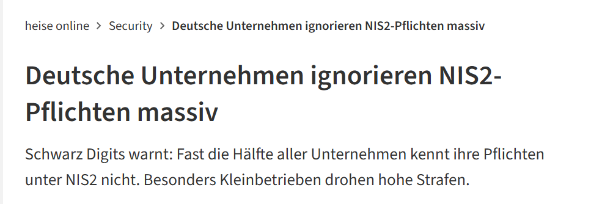

Quelle: heise online, 05.03.2026

---
<!-- _class: title -->
# ISMS
## Einführung & Überblick

---

# Was ist ein ISMS?
<!-- class: biglist -->

- Informationssicherheits-Managementsysteme
- Ganzheitliches Managementsystem zur Steuerung der Informationssicherheit
- Ziel: **Vertraulichkeit, Integrität, Verfügbarkeit** (CIA)
- Kombination aus Richtlinien, Prozessen, Rollen, Technologien
- Kontinuierliche Verbesserung durch PDCA-Zyklus

---

# Warum ISMS?

- Schutz vor Cyberangriffen, Datenverlust, Betriebsunterbrechungen
- Erfüllung gesetzlicher Anforderungen (DSGVO, NIS2, KRITIS)
- Vertrauensaufbau bei Kunden & Partnern
- Reduktion von Risiken und Schadenspotenzial

---
<!-- _class: chapter -->
# Internationale Standards

## ISO/IEC 27000‑Familie

---

# Internationale Standards: Überblick

- **ISO/IEC 27000**‑Familie als globaler De‑facto‑Standard
- Fokus auf Risikomanagement, Maßnahmenkataloge, Governance
- Modular aufgebaut: Kernstandard + ergänzende Normen
- **Zertifizierbar:** Ja, weltweit anerkannt

## **Ziel:** Anforderungen an Aufbau, Betrieb und Verbesserung eines ISMS 

---

# ISO/IEC 27001 – Der zentrale ISMS‑Standard

- **Inhalt:**  
  - Kontext der Organisation  
  - Führung & Rollen  
  - Planung (Risiken, Chancen)  
  - Unterstützung (Dokumentation, Ressourcen)  
  - Betrieb (Prozesse, Maßnahmen)  
  - Bewertung (Audits, KPIs)  
  - Verbesserung (Korrekturmaßnahmen)

---

# ISO/IEC 27001 – Anhang A (Controls) im Detail

- **Organisatorische Maßnahmen (37 Controls)**  
  Policies, Rollen, Lieferkettenmanagement, Projektmanagement.
- **Personenbezogene Maßnahmen (8 Controls)**  
  Schulungen, Hintergrundprüfungen, Disziplinarmaßnahmen.
- **Physische Maßnahmen (14 Controls)**  
  Zutrittskontrolle, Schutz vor Umwelteinflüssen, Überwachung.
- **Technische Maßnahmen (34 Controls)**  
  Logging, Kryptografie, Netzwerksicherheit, Secure Development.

---

# ISO/IEC 27002 – Maßnahmenkatalog
<!-- _class: normal -->
- Ergänzt ISO 27001 durch **konkrete Umsetzungshinweise**
- Beschreibt **Ziele, Maßnahmen, Leitlinien** für jede Control
- Beispiele:
  - Zugriffskontrolle  
  - Kryptografie  
  - Logging & Monitoring  
  - Lieferkettenmanagement  
  - Secure Development
- Nicht zertifizierbar, aber essenziell für die Praxis

---

# ISO/IEC 27005 – Risikomanagement im Detail

- Unterstützt die Umsetzung von Kapitel 6 der ISO 27001.
- Schritte:
  - Risikoidentifikation (Assets, Bedrohungen, Schwachstellen)
  - Risikoanalyse (qualitativ/quantitativ)
  - Risikobewertung (Akzeptanzkriterien)
  - Risikobehandlung (Reduktion, Transfer, Akzeptanz, Vermeidung)
- Ergebnis: **Risikobehandlungsplan**, Grundlage für Maßnahmen.

---

# ISO/IEC 27017 – Cloud Security

- Ergänzt ISO 27002 um **Cloud-spezifische Controls**.
- Beispiele:
  - Trennung von Kundenumgebungen (Multi-Tenancy)
  - Schutz von Cloud-APIs
  - Verantwortlichkeitsmatrix (Shared Responsibility Model)
  - Monitoring von Cloud-Ressourcen
- Wichtig für SaaS-, PaaS- und IaaS-Anbieter.

---

# ISO/IEC 27018 – Datenschutz in der Cloud

- Fokus: Schutz personenbezogener Daten in Cloud-Umgebungen.
- Anforderungen:
  - Transparenz über Datenverarbeitung
  - Zweckbindung & Löschkonzepte
  - Einschränkung von Zugriffen
  - Schutz vor unbefugter Weitergabe
- Ergänzt die DSGVO, aber global anwendbar.

---

# ISO/IEC 27701 – Privacy Information Management System (PIMS)

- Erweiterung von ISO 27001/27002 um Datenschutz
- Abdeckung von DSGVO-Anforderungen:
  - Rollen (Controller, Processor)
  - Datenschutz-Folgenabschätzung
  - Betroffenenrechte
- Zertifizierbar als Erweiterung

---

<!-- _class: chapter -->
# Europäische und deutsche Standards

## NIS2 und BSI IT-Gundschutz

---

# Europäische Vorgaben & Standards

- **NIS2-Richtlinie:** EU-weite Mindeststandards für Cybersicherheit  
- **DSGVO:** Datenschutzanforderungen, Schnittstellen zu ISMS  
- **EU Cybersecurity Act:** Zertifizierungsrahmen  
- **ENISA:** Leitlinien, Best Practices, Threat Landscape Reports

---
# NIS2 – Hintergrund & Zielsetzung

- NIS2 ist die überarbeitete EU-Richtlinie zur Cybersicherheit (2022).
- Ziel: EU-weit ein **einheitlich hohes Sicherheitsniveau** schaffen.
- Gründe für die Reform:
  - Zunahme von Cyberangriffen (Ransomware, Supply-Chain-Angriffe)
  - Unzureichende Umsetzung von NIS1
  - Erweiterung auf mehr Sektoren und Unternehmen
- NIS2 ist **verbindlich** und muss in nationales Recht umgesetzt werden.

---

# NIS2 – Erweiterter Geltungsbereich
<!-- class: normal -->

- Zwei Kategorien:
  - **Wesentliche Einrichtungen (Essential Entities)**  
    z. B. Energie, Gesundheit, Transport, Wasser, Finanzwesen, öffentliche Verwaltung
  - **Wichtige Einrichtungen (Important Entities)**  
    z. B. Postdienste, Abfallwirtschaft, Lebensmittel, Chemie, digitale Dienste
- Schwellenwerte:
  - Unternehmen ab **50 Mitarbeitenden** oder **10 Mio. € Umsatz**
  - Ausnahmen: Hochkritische Sektoren auch darunter

---

# NIS2 – Kernelemente der Sicherheitsanforderungen

- **Pflichtmaßnahmen**:
  - Sicherheitsrichtlinien & Governance
  - Incident Response
  - Business Continuity & Disaster Recovery
  - Supply-Chain-Security
  - Kryptografie & Verschlüsselung
  - Zugriffskontrolle & IAM
  - Logging, Monitoring, SIEM
  - Sichere Softwareentwicklung
- Starke Überschneidung mit ISO 27001 & BSI-Grundschutz

---

# NIS2 – Governance & Management-Verantwortung

- Geschäftsführung trägt **persönliche Verantwortung** für Cybersicherheit.
- Pflichten:
  - Genehmigung der Sicherheitsstrategie
  - Überwachung der Umsetzung
  - Teilnahme an verpflichtenden Schulungen
- Haftung:
  - Persönliche Sanktionen bei grober Fahrlässigkeit
  - Möglichkeit von Berufsverboten (in Extremfällen)

---

# NIS2 – Meldepflichten im Detail

- **24 Stunden**: Frühwarnung an nationale Behörde (z. B. BSI)
- **72 Stunden**: Incident-Report mit ersten Analysen
- **1 Monat**: Abschlussbericht mit Ursachenanalyse & Maßnahmen
- Meldepflicht gilt für:
  - Sicherheitsvorfälle mit erheblichem Einfluss
  - Vorfälle mit potenziell grenzüberschreitender Wirkung
- Ziel: Schnelle Reaktion & EU-weite Lagebilder

---

# NIS2 – Supply-Chain-Security

- Fokus auf Risiken durch Dienstleister & Lieferanten.
- Anforderungen:
  - Bewertung der Sicherheitslage von Lieferanten
  - Vertragsklauseln zu Sicherheit & Incident Response
  - Monitoring kritischer Dienstleister
  - Besondere Anforderungen für Cloud-Anbieter
- Konsequenz: Unternehmen müssen **Lieferketten-ISMS** etablieren.

---

# NIS2 – Technische Mindestanforderungen

- Einsatz moderner Sicherheitsmaßnahmen:
  - Multi-Faktor-Authentifizierung
  - Zero-Trust-Architekturen
  - Netzwerksegmentierung
  - Verschlüsselung ruhender & übertragener Daten
  - Patch- & Vulnerability-Management
  - Backup- & Recovery-Konzepte
- Orientierung an ISO 27001, BSI-Grundschutz, ENISA-Empfehlungen

---

# NIS2 – Dokumentationspflichten

- Pflicht zur umfassenden Dokumentation:
  - Sicherheitsrichtlinien
  - Risikobewertungen
  - Incident-Response-Prozesse
  - Business-Continuity-Pläne
  - Lieferantenbewertungen
  - Auditberichte
- Dokumentation muss **prüfbar** und **nachweisfähig** sein.

---

# NIS2 – Sanktionen & Durchsetzung

- Deutlich höhere Strafen als unter NIS1.
- Für wesentliche Einrichtungen:
  - Bis zu **10 Mio. €** oder **2 % des weltweiten Jahresumsatzes**
- Für wichtige Einrichtungen:
  - Bis zu **7 Mio. €** oder **1,4 % des Umsatzes**
- Weitere Maßnahmen:
  - Vor-Ort-Inspektionen
  - Sicherheitsprüfungen
  - Anordnungen zur Umsetzung von Maßnahmen

---

# NIS2 – Unterschiede zu NIS1

- Größerer Geltungsbereich
- Strengere Sicherheitsanforderungen
- Höhere Bußgelder
- Stärkere Governance-Pflichten
- Einheitlichere Umsetzung in der EU
- Fokus auf Lieferketten & Cloud
- Verpflichtende Management-Schulungen

---

# NIS2 – Nationale Umsetzung in Deutschland

- Umsetzung durch das **NIS2-Umsetzungs- und Cybersicherheitsstärkungsgesetz (NIS2UmsuCG)**.
- Rolle des BSI:
  - Aufsicht & Kontrolle
  - Meldestelle für Vorfälle
  - Vorgaben & Leitlinien
- Neue Kategorien:
  - „Besonders wichtige Einrichtungen“
  - „Wichtige Einrichtungen“
- Enge Verzahnung mit KRITIS & BSI-Gesetz

---

# NIS2 – Auswirkungen auf ISMS
<!-- class: biglist -->
- ISMS wird zum zentralen Werkzeug zur Erfüllung der Anforderungen.
- Notwendige Erweiterungen:
  - Lieferketten-Risikomanagement
  - Incident-Response-Playbooks
  - Business-Continuity-Management
  - Governance-Reporting an das Management
- Unternehmen ohne ISMS müssen eines einführen.

---

# NIS2 – Praktische Umsetzungsschritte

- Gap-Analyse gegen NIS2-Anforderungen
- Aufbau oder Erweiterung eines ISMS
- Definition von Rollen (CISO, Incident Manager)
- Erstellung von Richtlinien & Prozessen
- Lieferkettenanalyse & Vertragsanpassungen
- Aufbau eines Incident-Response-Teams
- Schulungen für Management & Mitarbeitende
- Vorbereitung auf Audits & Behördenprüfungen

---

# NIS2 – Zusammenfassung

- NIS2 ist ein umfassender EU-Rahmen für Cybersicherheit.
- Betroffen sind deutlich mehr Unternehmen als bisher.
- Fokus auf Risikomanagement, Governance, Lieferketten & Incident Response.
- ISMS ist der zentrale Baustein zur Umsetzung.
- Nationale Umsetzung in Deutschland verschärft Anforderungen weiter.

---

<!-- _class: chapter -->
# BSI IT‑Grundschutz

## Informationssicherheit mit System

---

# Deutsche Standards: BSI IT‑Grundschutz

- **BSI‑Standards 200‑1, 200‑2, 200‑3**
  - 200‑1: Managementsysteme für Informationssicherheit  
  - 200‑2: Vorgehensweise (Basis-, Standard-, Kern-Absicherung)  
  - 200‑3: Risikoanalyse
- **IT‑Grundschutz-Kompendium:**  
  - Bausteine (ORP, CON, OPS, SYS, NET, APP, IND)  
  - Maßnahmenkataloge  
  - Sehr detailliert, praxisorientiert
- **Zertifizierbar:** Ja (ISO‑ähnlich, aber DE-spezifisch)

---
# BSI IT‑Grundschutz – Zielsetzung & Philosophie

- Ziel: Ein **systematischer, praxisnaher und standardisierter Ansatz** zur Informationssicherheit.
- Fokus auf **Schutzbedarf** statt reinem Risikomanagement.
- Orientierung an **Best Practices** und realistischen Sicherheitsanforderungen.
- Modularer Aufbau ermöglicht flexible Anpassung an Organisationen jeder Größe.
- Grundlage für KRITIS‑Nachweise und staatliche Zertifizierungen.

---

# BSI IT‑Grundschutz – Bausteinmodell im Detail

## Bausteine strukturieren typische IT‑Landschaften:
- ORP – Organisation & Personal
- CON – Konzeption & Vorgehensweise
- OPS – Betrieb
- SYS – IT‑Systeme
- NET – Netzwerke
- APP – Anwendungen
- IND – Industrie/OT

---

# BSI IT‑Grundschutz – Bausteinmodell im Detail

## Jeder Baustein enthält:
- Beschreibung des betrachteten Bereichs
- Typische Gefährdungen
- Anforderungen (Basis, Standard, erhöht)

## Vorteil: **Hohe Wiederverwendbarkeit** und **klare Struktur**.

---

# BSI IT‑Grundschutz – Gefährdungskatalog

- Enthält typische Gefährdungen für alle Bausteine:
  - Höhere Gewalt (Feuer, Wasser, Naturkatastrophen)
  - Organisatorische Mängel
  - Menschliche Fehlhandlungen
  - Technisches Versagen
  - Vorsätzliche Handlungen (Angriffe)
- Gefährdungen dienen als Grundlage für die Ableitung von Maßnahmen.
- Vorteil: Keine vollständige Risikoanalyse nötig, da Gefährdungen bereits vordefiniert sind.

---

# BSI IT‑Grundschutz – Anforderungstypen

- **Basis-Anforderungen**  
  Mindestniveau, das jede Organisation erfüllen sollte.
- **Standard-Anforderungen**  
  Vollständige Umsetzung für ein angemessenes Sicherheitsniveau.
- **Erhöhte Anforderungen**  
  Für besonders schutzbedürftige Bereiche (z. B. KRITIS, Geheimschutz).
- Anforderungen sind **konkret formuliert**, z. B.:
  - „Es muss ein Patch-Management-Prozess existieren.“
  - „Zutritt zu Serverräumen muss kontrolliert werden.“

---

# BSI IT‑Grundschutz – Vorgehensweisen im Detail

- **Basis-Absicherung**  
  Schnell, pragmatisch, für kleine Organisationen.
- **Standard-Absicherung**  
  Vollständige Umsetzung aller relevanten Bausteine.
- **Kern-Absicherung**  
  Fokus auf besonders kritische Geschäftsprozesse.
- Ergänzt durch **Risikoanalyse nach 200‑3**, wenn:
  - erhöhte Anforderungen bestehen
  - Bausteine nicht ausreichen
  - besondere Bedrohungen existieren

---

# BSI‑Standard 200‑1 – Managementsysteme für Informationssicherheit

- Beschreibt Anforderungen an ein ISMS nach BSI‑Logik.
- Enthält:
  - Sicherheitsleitlinie
  - Rollen & Verantwortlichkeiten
  - Dokumentationsanforderungen
  - Audit- und Verbesserungsprozesse
- Starke Parallelen zu ISO 27001, aber stärker operationalisiert.

---

# BSI‑Standard 200‑2 – Vorgehensweise im Detail

- Enthält das **IT‑Grundschutz-Vorgehensmodell**:
  1. Initiierung des Sicherheitsprozesses
  2. Strukturierung des Informationsverbunds
  3. Schutzbedarfsfeststellung
  4. Modellierung mit Bausteinen
  5. Umsetzung der Anforderungen
  6. Ergänzende Risikoanalyse
  7. Kontinuierliche Verbesserung
- Ergebnis: **IT‑Grundschutz-Check** als Reifegradbewertung.

---

# BSI‑Standard 200‑3 – Risikoanalyse

- Ergänzt die Bausteine um individuelle Risiken.
- Schritte:
  - Identifikation besonderer Gefährdungen
  - Bewertung der Eintrittswahrscheinlichkeit
  - Bewertung der Schadenshöhe
  - Ableitung zusätzlicher Maßnahmen
- Wird nur angewendet, wenn Bausteine nicht ausreichen.

---

# BSI IT‑Grundschutz – Schutzbedarfsfeststellung

- Schutzbedarf wird für jedes Asset bestimmt:
  - Normal
  - Hoch
  - Sehr hoch
- Kriterien:
  - Vertraulichkeit
  - Integrität
  - Verfügbarkeit
- Grundlage für Auswahl der Anforderungen und Bausteine.

---

# BSI IT‑Grundschutz – Rollen & Verantwortlichkeiten

- **Informationssicherheitsbeauftragter (ISB)**  
  Koordination, Beratung, Reporting.
- **IT‑Betrieb**  
  Umsetzung technischer Maßnahmen.
- **Fachbereiche**  
  Verantwortung für Prozesse & Assets.
- **Management**  
  Freigabe der Sicherheitsstrategie, Ressourcen.
- Rollen sind klar definiert und verpflichtend.

---

# BSI IT‑Grundschutz – Zertifizierung

- Zertifizierung durch das BSI:
  - IT‑Grundschutz‑Audit
  - Prüfung der Umsetzung aller Anforderungen
  - Prüfung der Risikoanalyse (falls vorhanden)
- Zertifikatsarten:
  - IT‑Grundschutz Basis
  - IT‑Grundschutz Standard
  - IT‑Grundschutz Hoch
- Gültigkeit: 3 Jahre, jährliche Überwachungsaudits.

---

# BSI IT‑Grundschutz – Typische Herausforderungen

- Hoher Dokumentationsaufwand
- Komplexität der Bausteine
- Abhängigkeit von Fachbereichen
- Integration in bestehende Prozesse
- Ressourcenbedarf für Standard-Absicherung
- Herausforderung: „Papier-ISMS“ vermeiden

---

# BSI IT‑Grundschutz – Vorteile in der Praxis

- Sehr detailliert und praxisnah
- Gute Orientierung für Behörden & KRITIS
- Klare Anforderungen → weniger Interpretationsspielraum
- Gute Grundlage für Audits & Nachweise
- Hohe Akzeptanz in Deutschland

---

# BSI IT‑Grundschutz – Beispielhafte Modellierung

## Beispiel: „Webserver-Betrieb“

**Relevante Bausteine:**
- SYS.1.2 Server
- APP.3.1 Webanwendungen
- NET.3.2 DMZ
- OPS.1.1 Betrieb

---

# BSI IT‑Grundschutz – Beispielhafte Modellierung

**Anforderungen:**
- Härtung des Servers
- Patch-Management
- Logging & Monitoring
- Schutz vor Angriffen (WAF, IDS/IPS)

## Ergebnis: Vollständige Abdeckung typischer Risiken.

---

# BSI IT‑Grundschutz – Einsatz in KRITIS

## KRITIS-Betreiber müssen:
- Ein ISMS nach BSI-Standard nachweisen
- B3S oder IT‑Grundschutz anwenden
- Regelmäßige Audits durchführen
- Sicherheitsvorfälle melden

## IT‑Grundschutz ist oft die bevorzugte Methode für Behörden & kritische Sektoren.

---

# Bestandteile eines ISMS

- Sicherheitsleitlinie  
- Rollen & Verantwortlichkeiten  
- Risikomanagement  
- Dokumentation & Prozesse  
- Awareness & Schulungen  
- Technische & organisatorische Maßnahmen  
- Monitoring, Audits, KPIs  
- Kontinuierliche Verbesserung

---

# Umsetzung von Standards im Unternehmen

- Gap-Analyse  
- Aufbau der ISMS-Organisation  
- Erstellung von Richtlinien & Prozessen  
- Risikoanalyse & Risikobehandlung  
- Maßnahmenumsetzung  
- Interne Audits & Management-Review  
- Zertifizierung (optional)

---

<!-- _class: title -->

# Und nächstes Mal...