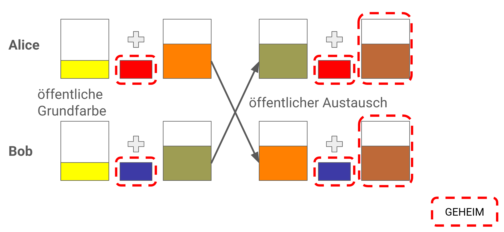

<!-- _class: title -->
# Kryptographie
## Verschlüsseln, Entschlüsseln und mehr

---

# Agenda

1. **Was ist Kryptographie?** (Ziele, Begriffe, Kerckhoffs' Prinzip)
2. **Geschichte:** Klassische Verfahren (Cäsar, Vigenère, Enigma)
3. **Symmetrische Verfahren** (Blockchiffren, AES, Betriebsmodi)
4. **Das Schlüsselproblem:** Schlüsselaustausch (Diffie-Hellman)
5. **Asymmetrische Verfahren** (Das Public-Key-Konzept, RSA)
6. **Mehr als Verschlüsselung:** Hashfunktionen und Digitale Signaturen
7. **Kryptoanalyse:** Methoden zum Knacken von Codes
8. **Praxis I:** E-Mail-Sicherheit (PGP und S/MIME)
9. **Praxis II:** Digital Rights Management (CSS, AACS)
10. **Exkurs:** Steganographie

---

# Was ist Kryptographie?
<!-- _class: biglist -->
- **Kryptographie:** ("Geheimes Schreiben") Die Wissenschaft der Verschlüsselung von Informationen. 
- **Kryptoanalyse:** Die Wissenschaft der Entschlüsselung (des "Brechens") von verschlüsselten Informationen. 
- **Kryptologie:** Das Überthema, das beide Disziplinen umfasst. 

---

# Die vier Schutzziele der Kryptographie

1.  **Vertraulichkeit (Confidentiality):** Nur autorisierte Personen können die Nachricht lesen. (Wird durch Verschlüsselung erreicht). 
2.  **Integrität (Integrity):** Die Nachricht wurde nicht unbemerkt verändert. (Wird durch Hashfunktionen / MACs erreicht). 
3.  **Authentizität (Authenticity):** Die Nachricht stammt nachweislich vom angegebenen Absender. (Wird durch Signaturen / MACs erreicht). 
4.  **Verbindlichkeit (Non-Repudiation):** Der Absender kann nicht abstreiten, die Nachricht gesendet zu haben. (Wird durch Digitale Signaturen erreicht). 

---

# Kerckhoffs' Prinzip (1883)

> Die Sicherheit eines kryptographischen Systems darf nicht von der Geheimhaltung des Algorithmus abhängen, sondern ausschließlich von der Geheimhaltung des Schlüssels. 

---
<!-- _class: chapter -->

# Symmetrische Verschlüsselung

## Klassische und moderne Verfahren

---

# Grundprinzipien Symmetrischer Verfahren

-  **Definition:** Ein gemeinsamer geheimer Schlüssel $K$ für Ver- und Entschlüsselung. 
-  **Funktionale Darstellung:**
    * Verschlüsselung: $C=E_{K}(P)$ 
    * Entschlüsselung: $P=D_{K}(C)$ 
-  **Klassifizierung:**
    * **Blockchiffren:** Verarbeiten Daten in festen Gruppen (Blöcken), z. B. AES (128 Bit). 
    * **Stromchiffren:** Verarbeiten Daten bit- oder byteweise als kontinuierlichen Strom, z. B. ChaCha20. 

---

# Grundprinzipien Symmetrischer Verfahren
<!-- _class: biglist -->
## Vorteile: 
- Hohe Verarbeitungsgeschwindigkeit
- effizient in Hardware und Software. 
## Nachteil: 
- Problematik des sicheren Schlüsselaustauschs
- Schlüsselverwaltung. 

---
<!-- _class: biglist -->
# Geschichte I: Klassische Verfahren
## Die Cäsar-Chiffre (Monoalphabetische Substitution)

-  **Algorithmus:** Verschiebe jeden Buchstaben im Alphabet um $K$ Positionen. 
-  **Beispiel:** $K=3$. 'A' $\rightarrow$ 'D', 'B' $\rightarrow$ 'E', ... 'Z' $\rightarrow$ 'C'.
    * `HALLO` $\rightarrow$ `KDOOR` 
-  **Mathematisch:** $C \equiv (P+K) \pmod{26}$ 
-  **Schwäche:** Extrem anfällig für **Frequenzanalyse** (Häufigkeitsanalyse). 'E' ist im Deutschen/Englischen der häufigste Buchstabe. [cite: 54, 55]

---

# Geschichte I: Klassische Verfahren
## Die Vigenère-Chiffre (Polyalphabetische Substitution)

-  **Algorithmus:** Nutzt ein Schlüsselwort (z. B. "AUTO"). Die Cäsar-Verschiebung ändert sich pro Buchstabe. 
    * **Schlüssel:** `AUTOAUTO` 
    * **Klartext:** `ANGRIFF` 
    * **Cäsar K:** (0 20 19 14 0 20 19) 
    * **Chiffre:** `A HZCIZD` 
-  **Stärke:** Glättet die Frequenzverteilung. Einfache Frequenzanalyse scheitert. 
-  **Schwäche:** Anfällig für **Kasiski-Test** (Finden von sich wiederholenden Blöcken) und statistische Analysen. [cite: 73, 74]

---
<!-- _class: biglist -->
# Kasiski-Test

-  **Ziel:** Polyalphabetische Substitution auf (mehrere) monoalphabetische Substitutionen reduzieren. 
-  **Vorgehen:**
    * Durch statistische Methoden wird die Schlüssellänge bestimmt. 
    * Finden von sich wiederholenden Mustern im verschlüsselten Text. 
-  **Voraussetzung:** Benötigt eine große Menge an verschlüsseltem Text. 

---

# Kasiski-Test - Beispiel

Text-Ausschnitt: `AXTRX TRYLC TYSZO EMLAF...` 

| Muster | Abstand | Faktorisierung |
| :--- | :--- | :--- |
| **XTR** | 3 | $3$ |
| **XRPI** | 98 | $2 \times 7 \times 7$ |
| **YFW** | 70 | $2 \times 5 \times 7$ |
| **YBCSMYFW** | 14 | $2 \times 7$ |

**Vermutete Schlüssellänge:** 7 

---
<!-- _class: biglist -->
# Geschichte II: Die Enigma

-  Automatisierte polyalphabetische Substitutions-Chiffre mit sehr großer Periodenlänge. 
-  Eingesetzt im Zweiten Weltkrieg (1939-1945) durch die Achsenmächte. 
-  Den Alliierten gelang die Entzifferung, was bis 1974 geheim gehalten wurde. 

---

# Geschichte II: Das Knacken der Enigma

-  **Beteiligte:** Marian Rejewski (Polen), Alan Turing (UK, Bletchley Park). 
-  **Konstruktionsfehler:** Der Reflektor verhinderte, dass ein Buchstabe mit sich selbst verschlüsselt wurde (z.B. 'A' $\neq$ 'A'). 
-  **Menschliche Fehler:**
    * Schlechte Grundstellungen (z.B. "AAA"). 
    * Stereotype Nachrichtenanfänge ("WETTERBERICHT"). 
-  **Angriffsmethode:** Known-Plaintext-Attack ("Cribs"). 
-  **Die "Turing-Bombe":** Elektromechanische Maschine zum parallelen Testen von Einstellungen. Widerlegte Millionen falscher Einstellungen.

---
<!-- _class: chapter -->
# Moderne symmetrische Verfahren

---

# Design-Konzepte: Konfusion und Diffusion

-  **Design-Ziele (Claude Shannon):**ssssssssssss
    * **Konfusion:** Zusammenhang zwischen Schlüssel und Geheimtext so komplex wie möglich gestalten. 
    * **Diffusion:** Einfluss eines Klartext-Bits auf möglichst viele Geheimtext-Bits ausweiten. 
-  **Strukturelle Implementierung:**
    * **Substitution:** Ersetzen von Bits (Konfusion). 
    * **Permutation:** Vertauschen von Bit-Positionen (Diffusion). 
-  **Iterative Chiffren:** Wiederholtes Anwenden dieser Operationen in Runden erhöht die Sicherheit. 

---

# Blockchiffre-Betriebsarten: ECB und CBC

-  **Problem:** Blockchiffren verschlüsseln nur 128 Bit; wie verarbeitet man Megabytes? 
-  **ECB (Electronic Codebook):**
    * Jeder Block wird unabhängig verschlüsselt. 
    * **Schwachstelle:** Identische Klartextblöcke ergeben identische Geheimtextblöcke (Mustererkennung!). 
    * *Beispiel:* Der "ECB-Pinguin" (Konturen bleiben sichtbar). 
-  **CBC (Cipher Block Chaining):**
    * Klartextblock wird mit dem vorherigen Geheimtextblock XOR-verknüpft. 
    * Erfordert einen zufälligen Initialisierungsvektor (IV). 

---

# Die Suche nach AES (NIST, 1997)

**Kriterien für den DES-Nachfolger:**
-  Symmetrische Blockchiffre. 
-  128 Bit Blocklänge. 
-  Schlüssel: 128, 192 und 256 Bit. 
-  Effizient in Hard- und Software (auch Smartcards). [cite: 168, 169, 172]
-  Resistent gegen alle bekannten Kryptoanalysen (inkl. Power-/Timing-Attacken). [cite: 170, 171]
-  Frei von Patenten (unentgeltlich nutzbar). 

---

# Der Advanced Encryption Standard (AES)

-  **Gewinner:** Algorithmus **Rijndael** (aus Belgien). 
-  **Struktur:** Substitution-Permutation Network (SPN). 
-  **Runden:** 10-14 Runden (je nach Schlüssellänge). [cite: 181, 182]
-  **Sicherheit:** Kein praktisch durchführbarer Angriff bekannt. 
-  **Effizienz:** Sehr hohe Performance in Hardware und Software. 
-  *Randnotiz:* US-Bedenken wegen europäischem Ursprung. 

---
<!-- _class: chapter -->
# Sicherer Schlüsselaustausch

## ...über unsichere Kanäle

---
<!-- _class: biglist -->
# Das Schlüsselproblem: Diffie-Hellman (DH)

-  **Problem:** Alice und Bob wollen symmetrisch (z. B. AES) kommunizieren, haben aber keinen sicheren Kanal für den Schlüsselaustausch. 
-  **Lösung (1976):** Verfahren zur Berechnung eines gemeinsamen Geheimnisses über einen öffentlichen Kanal. 

---

# Diffie-Hellman - Farbbeispiel

 
 

---

# Diffie-Hellman Schlüsselaustausch

-  **Mathematik:** Diskreter Logarithmus Problem (DLP). 
-  **Ablauf:**
    1.  Öffentliche Parameter: Primzahl $p$, Generator $g$. 
    2.  Alice wählt Geheimnis $a$, berechnet $A = g^a \pmod{p}$ $\rightarrow$ Bob. 
    3.  Bob wählt Geheimnis $b$, berechnet $B = g^b \pmod{p}$ $\rightarrow$ Alice. 
    4.  **Gemeinsamer Schlüssel $K$:**
        - Alice berechnet $K = B^a \pmod{p}$ 
        - Bob berechnet $K = A^b \pmod{p}$ 
-  Ein Angreifer kennt $g, p, A, B$, kann aber $g^{ab}$ nicht effizient berechnen. 

---

# Asymmetrische Verschlüsselung

---

# Paradigma und Einwegfunktionen

-  **Definition:** Nutzt ein Paar verknüpfter Schlüssel: **Public Key** und **Private Key**. 
-  **Konzept:** Trennung von Verschlüsselung (öffentlich) und Entschlüsselung (privat). 
-  **Grundlage:** **Falltür-Einwegfunktionen** (Trapdoor One-Way Functions). 
    * $y = f(x)$ ist leicht zu berechnen. 
    * $x = f^{-1}(y)$ ist ohne Zusatzwissen praktisch unmöglich. 
-  **Vorteile:** Lösung des Schlüsselaustauschproblems, hohe Skalierbarkeit. [cite: 236, 237]
-  **Nachteile:** Extrem langsam (Faktor 1000+ langsamer als AES). 

---

# Asymmetrische Verfahren: RSA - Grundlagen

-  **RSA (1977):** Meistverbreitetes asymmetrisches Verfahren. 
-  **Mathematik:** Faktorisierungsproblem großer Zahlen. 
-  Es ist einfach, $p \cdot q = N$ zu rechnen, aber schwer aus $N$ wieder $p$ und $q$ zu finden. 
-  **Hybride Verschlüsselung:** RSA wird nur für den Austausch des **Session Keys** genutzt; die Daten selbst werden mit AES verschlüsselt. [cite: 249, 250]

---

# RSA - Beispiel - Schritt 1 & 2

**Schritt 1: Wähle zwei Primzahlen**
-  $p = 11$ 
-  $q = 13$ 

**Schritt 2: Berechne den Modulus $n$**
-  $n = p \cdot q = 11 \cdot 13 = 143$ 

---

# RSA - Beispiel - Schritt 3 & 4

**Schritt 3: Eulersche Phi-Funktion $\Phi(n)$**
-  $\Phi(n) = (p-1) \cdot (q-1)$ 
-  $\Phi(143) = 10 \cdot 12 = 120$ 

**Schritt 4: Wähle öffentlichen Exponenten $e$**
- $e$ muss teilerfremd zu $\Phi(n)$ sein. 
- Gewählt: $e = 17$ (da $ggT(17, 120) = 1$). [cite: 273, 274]

---

# RSA - Beispiel - Schritt 5

**Schritt 5: Berechne privaten Exponenten $d$**
- $d$ ist das multiplikativ Inverse zu $e \pmod{\Phi(n)}$. 
- $(e \cdot d) \pmod{\Phi(n)} = 1$ 
- Ergebnis: $d = 113$ 

**Resultierende Schlüssel:**
- Privat: $(n, d) = (143, 113)$ 
-  Öffentlich: $(n, e) = (143, 17)$ 

---

# RSA - Beispiel - Verschlüsselung

- Nachricht (Zahl) $m = 88$ 
- Formel: $c = m^e \pmod{n}$ 
- Rechnung: $c = 88^{17} \pmod{143} = 121$ 

---

# RSA - Beispiel - Entschlüsselung

- Chiffrat $c = 121$ 
- Formel: $m = c^d \pmod{n}$ 
- Rechnung: $m = 121^{113} \pmod{143} = 88$ 
- Ergebnis: Die ursprüngliche Nachricht wurde korrekt wiederhergestellt.

---

# Was kommt nach RSA? - ECC

- **Grundidee:** Nutzung elliptischer Kurven über endlichen Körpern. 
- **Vorteil:** Gleiche Sicherheit bei wesentlich kürzeren Schlüsseln. 

**NIST Vergleich (128-Bit Sicherheit):**
- RSA: 3072 Bit Schlüssel 
- ECC: 256 Bit Schlüssel 

**Nutzen:** Weniger Rechenleistung, geringerer Energieverbrauch (IoT), schnellere Web-Handshakes. [cite: 310, 311]

---

# Kryptoanalyse

---

# Kryptoanalyse: Brute-Force

- **Definition:** Erschöpfendes Ausprobieren aller möglichen Schlüssel. 
- **Komplexität:** $2^k$ Versuche bei $k$ Bits. 
- **Beispiele:**
    * **DES (56 Bit):** Heute unsicher (in Stunden/Tagen knackbar). 
    * **AES (128 Bit):** Gilt als sicher gegen Brute-Force. 

---

# Kryptoanalyse - Angriffsmodelle

1.  **Ciphertext-Only (COA):** Nur verschlüsselte Daten bekannt. 
2.  **Known-Plaintext (KPA):** Paare aus Klartext und Geheimtext bekannt. 
3.  **Chosen-Plaintext (CPA):** Angreifer kann eigene Texte verschlüsseln lassen. 
4.  **Chosen-Ciphertext (CCA):** Angreifer kann manipulierte Geheimtexte entschlüsseln lassen (Orakel). 

---

# Mathematische Härte vs. Physische Realität

- **Mathe-Bruch:** Angriffe auf das Problem (z.B. Zahlkörpersieb GNFS für RSA-Faktorisierung). Längere Schlüssel (2048+ Bit) werden zwingend. [cite: 345, 346]
- **Physischer Bruch (Seitenkanäle):** Angriff auf die Hardware-Implementierung. 
    * **Timing:** Analyse der Rechenzeit. 
    * **Strom (DPA):** Energieverbrauch verrät Bit-Werte. 

---

# Hashes und Signaturen

---

# Hashfunktionen

- **Zweck:** Integritätsprüfung ("digitaler Fingerabdruck"). 
- **Eigenschaften:**
    1.  **Einwegfunktion:** Aus Hash $h$ kann Nachricht $M$ nicht berechnet werden. 
    2.  **Kollisionsresistenz:** Unmöglich, zwei verschiedene Nachrichten mit gleichem Hash zu finden. 
- **Beispiele:** SHA-256, SHA-3. (MD5 und SHA-1 gelten als gebrochen). 
- **Anwendung:** Passwort-Speicherung, Checksums, Blockchain. 

---

# Digitale Signaturen

**Signatur-Prozess (Alice):**
1.  Alice berechnet Hash der Nachricht: $h = H(M)$. 
2.  Alice "verschlüsselt" $h$ mit ihrem **Private Key**: $S = Enc(h, K_{priv})$. 

**Verifikations-Prozess (Bob):**
1.  Bob berechnet eigenen Hash der Nachricht: $h'$. 
2.  Bob "entschlüsselt" Signatur $S$ mit Alices **Public Key**: $h_{Alice} = Dec(S, K_{pub})$. 
3.  Prüfung: $h' == h_{Alice}$? 
    * **Ja:** Nachricht ist authentisch und integer. 

---

# Hybride Verschlüsselung (E-Mail-Sicherheit)

Kombination der Vorteile von Symmetrie (Speed) und Asymmetrie (Key-Verteilung). 

**Senden:**
1.  Zufälligen **Session Key** (AES) erzeugen. 
2.  Nachricht mit Session Key verschlüsseln. 
3.  Session Key mit dem **Public Key des Empfängers** verschlüsseln. 

**Empfangen:**
1.  Session Key mit eigenem **Private Key** entschlüsseln. 
2.  Nachricht mit Session Key entschlüsseln. 

---

# S/MIME – Hierarchie und X.509

- **Vertrauensmodell:** Hierarchische Public-Key-Infrastruktur (PKI). 
- **Zertifikate:** X.509-Standard, ausgestellt durch eine **Certificate Authority (CA)**. [cite: 415, 416]
- **Struktur:** Root-Zertifikat $\rightarrow$ Intermediate CA $\rightarrow$ User-Zertifikat. [cite: 419, 420]
- **Integration:** Nativ in Outlook/Apple Mail unterstützt. 

---

# OpenPGP - Modularität und Pakete

- **Struktur:** Sequenz von Paketen. 
    * Tag 1: Asymmetrischer Session Key. 
    * Tag 11: Literal Data (Text). 
- **ASCII Armor:** Radix-64 Kodierung wandelt Binärdaten in Text um (`-----BEGIN PGP MESSAGE-----`). [cite: 432, 435]

---

# Das PGP Web of Trust (WoT)

Dezentrale Validierung statt zentraler CA. 
- **Validität:** Gehört der Key wirklich Person X? 
- **Owner Trust:** Vertraue ich Person X bei der Prüfung anderer? 
- **1-Full / 3-Marginal Regel:** Key ist gültig bei einer Signatur durch voll vertrauenswürdige Person oder drei marginal vertrauenswürdige. [cite: 448, 449]
- **Key Signing Parties:** Physisches Treffen zum ID-Abgleich. 

---

# S/MIME vs. OpenPGP - Der Vergleich

| Merkmal | S/MIME | OpenPGP |
| :--- | :--- | :--- |
| **Vertrauen** | Hierarchisch (zentral) | Web of Trust (dezentral) |
| **Zertifikate** | X.509 (oft kostenpflichtig) | PGP-Keys (kostenlos) |
| **Verbreitung** | Konzern-Standard | Tech-Community, Journalisten |
| **Key Exchange** | Automatisch via Signatur | Manuell (Keyserver) |
| **Forward Secrecy**| Meist nicht vorhanden | Meist nicht vorhanden |

---

# Praxis II: Digital Rights Management (DRM)

---

# Das DRM Schlüssel-Dilemma

- **Rechteinhaber:** Will Inhalt geheim halten und Nutzung kontrollieren. 
- **Nutzer:** Muss den Inhalt entschlüsseln können, um ihn zu konsumieren. 
- **Dilemma:** Der Schlüssel muss zum Nutzer, darf aber nicht von ihm kopiert werden.

---

# DRM Systeme im Laufe der Zeit

| Medium | Technik |
| :--- | :--- |
| **VHS** | Analoge Kopierschutzmechanismen |
| **DVD** | Content Scramble System (CSS) |
| **Blu-ray** | Advanced Access Content System (AACS) |
| **Streaming** | Widevine, PlayReady (Adaptive DRM) |
| **Hardware** | Trusted Platform Module (TPM) |

---

# Warum DRM oft scheitert

**Mangelnde Kontrolle der Ausführungsumgebung:**
- **Reverse Engineering:** Analyse mit Debuggern/Disassemblern auf dem eigenen System. [cite: 467, 468]
- **Memory Dumping:** Auslesen des Schlüssels direkt aus dem RAM. 
- **Patching/Hooking:** Manipulation der Software, um Prüfungen zu umgehen. 

---

# Moderne DRM-Systeme: Trusted Execution (TEE)

**Google Widevine Level:**
- **Level 3 (L3):** Rein softwarebasiert (oft nur SD-Qualität). 
- **Level 1 (L1):** Hardware-Isolation. 
    * Entschlüsselung nur im **TEE** (z.B. ARM TrustZone). 
    * **Trusted Video Path (TVP):** Frame geht direkt vom TEE zum Grafikchip; OS hat keinen Zugriff auf Rohdaten. 

---

# Steganographie

---

# Exkurs: Steganographie - Informationen verstecken

- **Ziel:** Unauffälligkeit. Dritte sollen nicht einmal bemerken, dass eine Kommunikation stattfindet.
- **Carrier (Träger):** Medium (Bild, Audio, Video). 
- **Nutzlast:** Die versteckte Information. 
- **Abgrenzung:** Kryptographie macht Text unlesbar; Steganographie macht Kommunikation unsichtbar. 

---

# Least Significant Bit (LSB) Substitution

- **Prinzip:** Digitale Medien enthalten Redundanz. 
- Eine Änderung der niederwertigsten Bits (LSB) ist für Menschen nicht wahrnehmbar. 
- **Beispiel (24-Bit RGB-Bild):**
    * Ein Pixel hat 3 Bytes (Rot, Grün, Blau). 
    * Ändere das letzte Bit jedes Farbkanals (z.B. Wert 255 $\rightarrow$ 254). 
    * **Kapazität:** 3 Bit pro Pixel. In hochauflösenden Bildern lassen sich so große Datenmengen verstecken. 