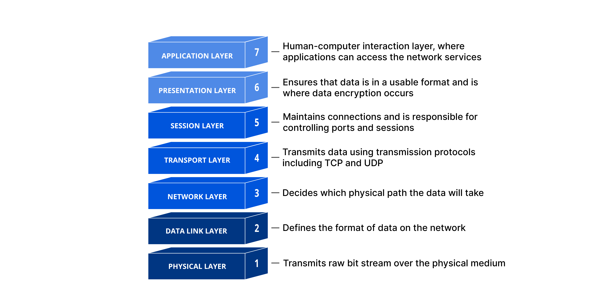
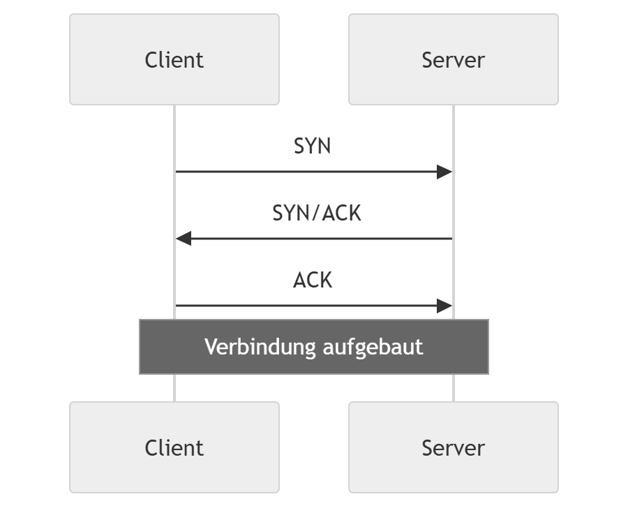

<!-- _class: chapter -->

# Fallstudie: Der Heartbleed-Bug (CVE-2014-0160)
## Analyse einer kritischen Sicherheitslücke in OpenSSL

---

# Was ist passiert?
<style scoped>
li { line-height: 1.7; font-size: 24pt}
</style>
- **Veröffentlichung:** April 2014.
- **Betroffene Komponente:** OpenSSL-Bibliothek (Versionen 1.0.1 bis 1.0.1f).
- **Kern des Problems:** Eine Schwachstelle in der Implementierung der TLS/DTLS-Heartbeat-Erweiterung (RFC 6520).
- **Auswirkung:** Angreifer konnten pro Anfrage bis zu 64 KB des Hauptspeichers des Servers auslesen – und das wiederholt, ohne Spuren zu hinterlassen.

---

# Warum ist es passiert? (Die technische Ursache)
<style scoped>
li { line-height: 1.7; font-size: 24pt}
</style>
- **Fehlende Bound-Check-Prüfung:** Der Heartbeat-Mechanismus funktioniert nach dem Echo-Prinzip:
  1. Client sendet "Payload" und die "Länge der Payload".
  2. Server kopiert die Payload in eine Antwort und sendet sie zurück.
- **Der Exploit:** Der Angreifer sendet eine Payload von z.B. 1 Byte, behauptet aber im Längenfeld, sie sei 65.535 Bytes (64 KB) groß.
- **Die Folge:** `memcpy()` kopiert über die tatsächliche Payload hinaus Daten aus dem angrenzenden Arbeitsspeicher des Servers in den Antwort-Puffer.

---

# Code-Analyse (Vereinfachtes C-Beispiel)

```c
/* Der fatale Fehler in OpenSSL (dtls1_process_heartbeat) */

unsigned int payload;
unsigned char *p = &s->s3->rrec.data[0]; // Empfangene Daten
payload = (p[0] << 8) | p[1];            // Vertrauen in die Längenangabe!

/* ... später im Code ... */

unsigned char *buffer = OPENSSL_malloc(1 + 2 + payload + padding);
bp = buffer;

/* PROBLEM: memcpy liest 'payload' Bytes, auch wenn 'p' kleiner ist */
memcpy(bp, pl, payload); 

```

---
<style scoped>
li { line-height: 1.7; font-size: 24pt}
</style>
# Was befand sich im Speicher?

Durch das Auslesen des Speichers konnten Angreifer folgende sensible Daten extrahieren:

* **Private Schlüssel:** RSA/DSA Private Keys (ermöglicht Entschlüsselung des gesamten Traffics).
* **Session-IDs:** Übernahme aktiver Nutzersitzungen.
* **Benutzerdaten:** Passwörter im Klartext, E-Mail-Adressen, Kreditkartendaten.
* **System-Informationen:** Speicher-Layouts, die weitere Exploits erleichterten.

---

# Was können wir daraus lernen?

* **Vertraue niemals User-Input:** Jede Längenangabe, die von außen kommt, muss gegen die tatsächliche Größe des Puffers validiert werden.
* **Speichersichere Sprachen vs. C:** In Rust oder Java wäre dieser Fehler durch automatische Bounds-Checks zur Laufzeit verhindert worden.
* **Komplexität reduzieren:** Die Heartbeat-Erweiterung war für viele Nutzer unnötig, erhöhte aber die Angriffsfläche massiv.
* **Bedeutung von Audits:** Open Source ist nicht automatisch sicher; kritische Infrastruktur-Software benötigt professionelle Code-Audits.

---

# Agenda
<style scoped>
li { line-height: 1.7; font-size: 24pt}
</style>
- Das ISO/OSI-Schichtenmodell und Sicherheit
- Typische Angriffe und Tools (Angriff vs. Abwehr)
- Protokollanalyse: Sicher vs. Unsicher
- Firewalls: Typen und Funktionsweisen
- VPN: Tunneling und Verschlüsselung
- Das TOR-Netzwerk

---

# Das ISO/OSI-Modell & Security



---
<!-- _class: chapter -->

# Layer‑1

## Physical Layer

---

# Layer 1 – Physikalische Schicht

**Aufgabe**  
Übertragung roher Bits (0/1) über Medium

**Medien**  
- Kupfer (UTP/STP)  
- Glasfaser  
- Wireless (Wi-Fi, Bluetooth, 5G, ZigBee)  

**Wichtig**: Alles physisch berührbar → hoch angreifbar!

---

# Warum ist Layer 1 ein Ziel?
<style scoped>
li { line-height: 1.7; font-size: 24pt}
</style>
- Keine Verschlüsselung auf L1  
- Physischer Zugang oft unterschätzt  
- Ausfall hier = Totalausfall des Netzes  
- „Soft underbelly“ der IT-Sicherheit

---

# Angriffe auf Layer 1

## Physische Zerstörung / Tampering
- Kabel durchschneiden, Geräte entfernen  
- Rogue-Hardware einstecken  

## Passives Abhören (Eavesdropping)
- Kupfer: Passive TAPs  
- Glasfaser: Bending-Attack / Optical Splitter  
- Wireless: Richtantenne + SDR  

---

# Angriffe auf Layer 1

## Aktive Störung (Jamming / EMI)
- Wi-Fi/Bluetooth/5G-Störsender  
- Deauth-Flood über L1  

## Side-Channel
- TEMPEST / Van-Eck (EM-Abstrahlung)  
## Hardware-Implantate
- Modifizierte NICs, Rogue Access Points

---

# Gegenmaßnahmen

**Physisch**  
- Zutrittskontrolle, versiegelte Schränke  
- Kabel in Rohren, Port-Locking  

**Technisch**  
- STP / gepanzerte Kabel bevorzugen  
- Glasfaser statt Kupfer  
- OTDR-Monitoring  
- **End-to-End-Verschlüsselung** (TLS 1.3, IPsec, WireGuard) → Tapping nutzlos!

---

# Gegenmaßnahmen

**Wireless**  
- WPA3-Enterprise + PMF  
- Frequency Hopping

**Organisatorisch**  
- Physical-Security-Audits  
- Redundanz (2-Wege + LTE-Backup)

---

# Zusammenfassung & Takeaways

**Layer 1 = Fundament**  
Low-Tech-Angriffe mit hoher Wirkung!

**3 wichtigste Regeln**  
1. Physische Sicherheit zuerst  
2. Immer verschlüsseln (auch wenn L1 geknackt wird)  
3. Defense-in-Depth: L1 + L2–L7

**Merksatz**  
Ohne guten Layer-1-Schutz ist der Rest nur Kosmetik.

---
<!-- _class: chapter -->
# Layer‑2

## Data Link Layer

--- 

# ARP – Address Resolution Protocol 

## Grundlagen 
<style scoped>
li { line-height: 1.7; font-size: 24pt}
</style>
- ARP gehört zu **Layer 2/3** (Übergangsschicht) 
- Aufgabe: Zu einer **IPv4‑Adresse** die **MAC‑Adresse** ermitteln 
- Wird in jedem LAN ständig genutzt 
- Funktioniert **broadcast‑basiert** 
- Keine Authentifizierung → anfällig für Manipulation 

--- 

# ARP – Funktionsweise 
<style scoped>
li { line-height: 1.7; font-size: 24pt}
</style>
- Host benötigt MAC zu einer IP 
- Sendet **ARP Request** (Broadcast): 
  - „Wer hat IP X? Bitte sende mir deine MAC.“ 
- Zielhost antwortet mit **ARP Reply** (Unicast): 
  - „IP X gehört zu MAC Y.“ 
- Host speichert Zuordnung im **ARP‑Cache** 

---

# ARP Spoofing 

## (ARP Poisoning) 
<style scoped>
li { line-height: 1.7; font-size: 24pt}
</style>
- Manipulation des ARP‑Caches eines Hosts 
- Angreifer sendet gefälschte ARP‑Antworten 
- Opfer übernimmt falsche MAC‑Adresse für Gateway oder andere Hosts 
- Ziel: **Man‑in‑the‑Middle**, **Traffic‑Manipulation**, **Sniffing** 

--- 

# Funktionsweise: ARP Spoofing 
<style scoped>
li { line-height: 1.7; font-size: 24pt}
</style>
- ARP ist **ungesichert** und akzeptiert jede Antwort 
- Angreifer sendet: - „IP des Gateways → meine MAC“ 
- „IP des Opfers → meine MAC“ 
- Beide Kommunikationspartner senden Traffic an den Angreifer 
- Angreifer leitet weiter → bleibt unentdeckt 

--- 

# Auswirkungen von ARP Spoofing 
<style scoped>
li { line-height: 1.7; font-size: 24pt}
</style>
- MITM über das gesamte Subnetz 
- Abgreifen sensibler Daten (HTTP, FTP, Telnet, POP3 …) 
- Session Hijacking - DNS‑Manipulation 
- DoS möglich (Frames nicht weiterleiten) 

--- 

# Gegenmaßnahmen: ARP Spoofing 

- **Dynamic ARP Inspection (DAI)** 
  - Validiert ARP‑Pakete anhand DHCP‑Snooping‑Datenbank 
- **DHCP Snooping** 
  - Grundlage für DAI 
- **Statische ARP‑Einträge** (nur in Spezialfällen praktikabel) 
- **Port Security** 
- **IDS/IPS** zur Erkennung von ARP‑Anomalien 
- **VLAN‑Segmentierung** 

--- 

# DHCP Spoofing - Rogue DHCP Server 
<style scoped>
li { line-height: 1.7; font-size: 24pt}
</style>
- Angreifer betreibt eigenen DHCP‑Server 
- Opfer erhält falsche Netzwerkkonfiguration 
- Angreifer bestimmt: 
  - Default Gateway 
  - DNS‑Server 
  - Domain‑Suffix 
- Ermöglicht vollständigen **MITM** über das gesamte Subnetz 

--- 

# Funktionsweise: DHCP Spoofing 
<style scoped>
li { line-height: 1.7; font-size: 24pt}
</style>
- DHCP‑Discover wird von allen Servern beantwortet 
- Angreifer antwortet schneller als legitimer Server 
- Opfer übernimmt falsche Konfiguration - Angreifer kann: 
  - Traffic umleiten 
  - DNS‑Anfragen manipulieren 
  - Routen verändern 
  - DoS verursachen 

--- 

# Auswirkungen von DHCP Spoofing
<style scoped>
li { line-height: 1.7; font-size: 24pt}
</style>
 - Komplette Netzwerkkontrolle über alle Clients 
 - Phishing durch DNS‑Manipulation 
 - Traffic‑Umleitung über Angreifer 
 - Ausfall des legitimen Gateways 
 - Sehr schwer zu erkennen ohne Schutzmechanismen 
 
 ---

# Gegenmaßnahmen: DHCP Spoofing 
<style scoped>
li { line-height: 1.7; font-size: 24pt}
</style>
- **DHCP Snooping** 
  - Markiert Ports als „trusted“ oder „untrusted“ 
  - Nur vertrauenswürdige Ports dürfen DHCP‑Server‑Antworten senden 
- **Port Security** 
- **VLAN‑Segmentierung** 
- **802.1X** zur Authentifizierung von Endgeräten 
- Monitoring ungewöhnlicher DHCP‑Aktivität
 
 --- 
 
 # Vergleich: ARP vs. DHCP Spoofing 
 
 | Angriff | Häufigkeit | Gefährlichkeit | Grund |
  |--------|------------|----------------|-------| 
  | **ARP Spoofing** | Sehr häufig | Mittel–hoch | ARP ist ungeschützt, überall aktiv | 
  | **DHCP Spoofing** | Weniger häufig | Sehr hoch | Komplette Netzwerkkontrolle möglich | 
  
  --- 
  
  # Fazit 
  
  - **ARP Spoofing**: häufigster Layer‑2‑Angriff, leicht durchführbar 
  - **DHCP Spoofing**: gefährlichster Angriff, ermöglicht vollständigen MITM 
  
  - Effektive Schutzmaßnahmen: 
    - DHCP Snooping 
    - Dynamic ARP Inspection 
    - Port Security 
    - 802.1X 
    - Saubere VLAN‑Konfiguration 
    

---
<!-- _class: chapter -->
# Layer 3

## Netzwerkebene

---

# Layer‑3 Angriffe  
## Fokus: IP‑Spoofing & BGP Hijacking

## Netzwerkebene (Routing, Adressierung)
- Zwei Angriffe dominieren:
  - **IP‑Spoofing** → am häufigsten
  - **BGP Hijacking** → am gefährlichsten
- Beide Angriffe wirken auf fundamentale Mechanismen des Internets

---

# IP‑Spoofing  
## Der häufigste Layer‑3‑Angriff

- Manipulation der **Quell-IP-Adresse**
- Angreifer sendet Pakete mit gefälschter Absenderadresse
- Wird in vielen anderen Angriffen als Baustein genutzt:
  - DDoS Reflection/Amplification
  - Umgehung von IP-basierten ACLs
  - Verschleierung der Identität
- IPv4 bietet **keine Authentizität** der Absenderadresse

---

# Funktionsweise von IP‑Spoofing

- Angreifer setzt die Quell-IP im IP‑Header manuell
- Router überprüfen standardmäßig nicht, ob die Quelle plausibel ist
- Antworten gehen an die gefälschte Adresse, nicht zum Angreifer
- Besonders effektiv bei:
  - **stateless** Protokollen (UDP, ICMP)
  - **Reflection-Angriffen**

---

# Typische Einsatzszenarien

- **DDoS Reflection/Amplification**
  - DNS, NTP, CLDAP, SSDP
  - Kleine Anfrage → große Antwort an Opfer
- **Firewall-Bypass**
  - ACLs, die nur IP‑Ranges erlauben
- **Anonymisierung**
  - Erschwert Attribution und Forensik

---

# Tools für IP‑Spoofing

- `hping3`  
  - Crafting beliebiger IP‑Pakete
- `scapy`  
  - Python‑Framework für Paketmanipulation
- `nping` (Nmap)  
  - Spoofing‑fähige Netzwerktests
- `nemesis`  
  - Low‑level Packet Injection

---

# Gegenmaßnahmen gegen IP‑Spoofing

- **Ingress Filtering (BCP 38)**  
  - Blockiert Pakete mit ungültigen Quelladressen am Netzrand
- **Egress Filtering**  
  - Verhindert Spoofing aus dem eigenen Netz
- **uRPF (Unicast Reverse Path Forwarding)**  
  - Router prüfen, ob die Quelle über die eingehende Route erreichbar ist
- **IDS/IPS**  
  - Erkennung ungewöhnlicher Muster
- **Logging & Anomalieerkennung**

---

# BGP Hijacking  
## Der gefährlichste Layer‑3‑Angriff

- Manipulation des Border Gateway Protocol (BGP)
- Angreifer kündigt fremde IP‑Präfixe an
- Ziel:
  - Umleitung von Traffic (MITM)
  - Blackholing (Unerreichbarkeit)
  - Wirtschaftliche oder politische Sabotage
- Auswirkungen können **global** sein

---

# Warum ist BGP so verwundbar?

- BGP basiert auf **Vertrauen** zwischen Autonomous Systems (AS)
- Historisch **keine Authentifizierung** der Routen
- Fehler oder Angriffe verbreiten sich schnell über das Internet
- Große Abhängigkeit:
  - ISPs
  - Cloud‑Provider
  - Kritische Infrastruktur

---

# Arten von BGP Hijacking

- **Prefix Hijack**  
  - Angreifer kündigt ein fremdes Präfix an
- **Subprefix Hijack**  
  - Angreifer kündigt *kleinere* Netze an → bevorzugte Route
- **Route Leak**  
  - Fehlkonfiguration führt zu falscher Weitergabe von Routen
- **MITM über BGP**  
  - Traffic wird über Angreifer umgeleitet, dann weitergeleitet

---

# Realwelt‑Beispiele

- **2008 – Pakistan vs. YouTube**  
  - Fehlkonfiguration → globaler Ausfall von YouTube
- **2017 – Google Traffic über Russland/China**  
  - BGP‑Hijack führte zu globaler Umleitung
- **2022 – Krypto‑Börsen kompromittiert**  
  - Präfixe entführt, Traffic abgefangen

---

# Tools für BGP‑Angriffe (in Testumgebungen)

- `scapy`  
  - Crafting von BGP‑Paketen
- BGP‑Testframeworks in Laborumgebungen
- Router‑Emulatoren (GNS3, EVE‑NG)  
  - Simulation von Hijacks zu Forschungszwecken

---

# Gegenmaßnahmen gegen BGP Hijacking

- **RPKI (Resource Public Key Infrastructure)**  
  - Kryptografische Validierung von Präfixen
- **Route Filtering**  
  - ISPs filtern ungültige Ankündigungen
- **Prefix‑Listen & AS‑Path‑Filter**
- **Monitoring‑Tools**  
  - BGPmon  
  - RIPE RIS  
  - Cloudflare Radar
- **Mutual Authentication**  
  - MD5/HMAC für BGP‑Sessions

---

# Vergleich der beiden Angriffe

| Angriff | Häufigkeit | Schaden | Reichweite | Hauptproblem |
|--------|------------|---------|------------|--------------|
| **IP‑Spoofing** | Sehr hoch | Mittel | Lokal/Netzwerk | Keine Authentizität in IPv4 |
| **BGP Hijacking** | Niedrig | Extrem hoch | Global | Vertrauensbasiertes Routing |

---

# Fazit

- **IP‑Spoofing** ist der am weitesten verbreitete Layer‑3‑Angriff  
- **BGP Hijacking** ist der gefährlichste Angriff mit globalem Impact  
- Effektive Verteidigung erfordert:
  - Netzwerkrand‑Filterung
  - Routing‑Authentifizierung
  - Monitoring & schnelle Reaktion
  - Kooperation zwischen Netzbetreibern

---
<!-- _class: chapter -->

# Layer‑4

## Transport Layer

---

# Überblick: Layer 4 (Transport Layer)

- Protokolle: **TCP** und **UDP**
- Aufgaben:
  - Ende-zu-Ende-Kommunikation
  - Portverwaltung
  - Zuverlässigkeit (nur TCP)
  - Fluss- und Fehlerkontrolle
- Warum relevant?
  - Grundlage fast aller Internetdienste (HTTP, SSH, SMTP, …)

---
<!-- _class: chapter -->>

# SYN-Flooding  
## Der häufigste und wirkungsvollste Angriff auf Layer 4  

---

# Warum ist SYN-Flooding so gefährlich?

- Nutzt grundlegenden Mechanismus des TCP-Verbindungsaufbaus aus
- Funktioniert gegen nahezu jeden TCP-basierten Dienst
- Benötigt keine Schwachstelle im Zielsystem
- Sehr leicht zu automatisieren
- Kann Server, Firewalls und Load Balancer überlasten
- Häufigster Bestandteil moderner DDoS-Angriffe

---

# Das Konzept hinter TCP-SYN  
## Wie funktioniert der TCP-3-Way-Handshake?

- TCP-Verbindungen werden über einen **3‑Way‑Handshake** aufgebaut:
  - **SYN** → Client möchte Verbindung aufbauen
  - **SYN/ACK** → Server bestätigt und reserviert Ressourcen
  - **ACK** → Client bestätigt, Verbindung steht

- Ziel:  
  - Zuverlässige, geordnete Verbindung  
  - Synchronisation der Sequenznummern  
  - Vorbereitung der Datenübertragung

---

# Visualisierung: 3-Way-Handshake

<style scoped>
p { text-align: center; }
</style>


## Wichtig: Der Server reserviert Ressourcen **bereits nach dem SYN**  

---

# Was passiert bei einem SYN-Flood?

- Angreifer sendet **massiv viele SYN-Pakete**
- IP-Adressen sind häufig **gespooft**
- Server erzeugt für jedes SYN einen **halboffenen Eintrag** (SYN-RECEIVED)
- Der letzte Schritt (ACK) kommt nie an
- Die Warteschlange (Backlog) läuft voll
- Neue legitime Verbindungen werden abgelehnt

---

# Auswirkungen eines SYN-Floods

- Dienste werden unerreichbar
- Server reagiert extrem langsam oder gar nicht
- Firewalls können überlastet werden
- Load Balancer verlieren Sessions
- Kritische Systeme (z. B. Online-Shops, APIs) fallen aus

---

# Erkennung eines SYN-Floods

- Ungewöhnlich viele SYN-Pakete
- Viele halboffene Verbindungen (SYN-RECEIVED)
- Hohe CPU-Last auf Firewalls
- Monitoring-Tools:
  - NetFlow / sFlow
  - IDS/IPS (Snort, Suricata)
  - Systemlogs (dmesg, netstat)

---

# Gegenmaßnahmen: Netzwerk- und Systemebene

- **SYN Cookies**
  - Server speichert keine halboffenen Verbindungen mehr
- **Backlog erhöhen**
  - Größere Warteschlange
- **Timeouts reduzieren**
  - Halboffene Verbindungen werden schneller verworfen
- **Rate Limiting**
  - Begrenzung der SYN-Pakete pro Quelle
- **Firewall-Regeln**
  - Stateful Inspection
  - SYN-Proxying

---

# Gegenmaßnahmen: Infrastruktur

- **Load Balancer**
  - Verteilen Last, filtern SYN-Floods
- **DDoS-Mitigation-Provider**
  - Cloudflare, Akamai, AWS Shield
- **Anycast-Netzwerke**
  - Verteilen Traffic global
- **ISP-Level Filtering**
  - BCP 38 (Ingress Filtering gegen IP-Spoofing)

---

# Warum ist SYN-Flooding der "schlimmste" Layer‑4‑Angriff?

- Greift fundamentalen Mechanismus an
- Funktioniert gegen fast alle TCP-Dienste
- Sehr schwer eindeutig zu filtern
- Extrem häufig in realen DDoS-Kampagnen
- Kann selbst große Systeme lahmlegen
- Benötigt wenig Bandbreite → hoher Wirkungsgrad

---
<!-- _class: chapter -->

# Layer‑5

## Session Layer

---

# Leyer 5 -  Session Layer

- Verantwortlich für **Aufbau, Verwaltung und Beendigung von Sitzungen**  
- Regelt **Dialogkontrolle** (wer sendet wann)  
- Stellt **Synchronisation** bereit (Checkpoints, Wiederaufnahme)  
- Typische Protokolle:  
  - RPC (Remote Procedure Call)  
  - NetBIOS  
  - PPTP  
  - TLS‑Handshake‑Mechanismen (teilweise)

---

# Häufigster Angriff auf Schicht 5  
## Session Hijacking

- Angreifer übernimmt eine bestehende Sitzung zwischen Client und Server  
- Ziel: Zugriff auf Ressourcen, Identitätsübernahme, Manipulation  
- Besonders relevant bei **Web‑Sessions**, VPN‑Sessions, Remote‑Diensten  
- Erfolgt meist durch Ausnutzen schwacher oder gestohlener Session‑Tokens

---

# Warum Session Hijacking so verbreitet ist

- Viele Anwendungen nutzen **Session‑IDs** statt dauerhafter Authentifizierung  
- Session‑IDs sind oft:
  - schlecht geschützt  
  - vorhersehbar  
  - unverschlüsselt übertragen  
- Nutzer arbeiten häufig in **unsicheren Netzwerken** (WLAN, Hotspots)  
- Angriffe sind technisch relativ einfach durchzuführen

---

# Grundlagen: Wie funktionieren Sessions?

- Nach erfolgreicher Authentifizierung erzeugt der Server ein **Session‑Token**  
- Dieses Token identifiziert den Nutzer während der gesamten Sitzung  
- Token wird typischerweise übertragen via:
  - Cookies  
  - URL‑Parameter  
  - HTTP‑Header  
- Wer das Token besitzt, **gilt als authentifiziert**

---

# Wie funktioniert Session Hijacking?

1. **Session‑Token abfangen**  
   - Sniffing in unverschlüsselten Netzwerken  
   - Man‑in‑the‑Middle‑Angriffe  
   - Cross‑Site‑Scripting (XSS)  
2. **Session‑Token erraten**  
   - Schwache oder vorhersehbare Token  

---

# Wie funktioniert Session Hijacking?   

3. **Session‑Token stehlen**  
   - Malware  
   - Browser‑Exploits  
4. **Session übernehmen**  
   - Angreifer sendet das Token an den Server  
   - Server erkennt keinen Unterschied zwischen legitimen Nutzer und Angreifer

---

# Varianten des Session Hijacking

- **Active Hijacking**  
  Angreifer übernimmt aktiv die Verbindung und sendet eigene Pakete  
- **Passive Hijacking**  
  Angreifer liest nur mit, um Informationen zu sammeln  
- **Session Fixation**  
  Angreifer zwingt das Opfer, ein vorher bekanntes Token zu verwenden  
- **Cross‑Site‑Scripting‑basiertes Hijacking**  
  Token wird über JavaScript ausgelesen

---

# Gegenmaßnahmen (technisch) 1

## Schutz auf Protokoll‑ und Anwendungsebene

- **TLS/HTTPS erzwingen**  
  verhindert Sniffing  
- **Secure & HttpOnly Cookies**  
  schützt vor XSS‑basiertem Diebstahl  
- **Session‑Timeouts**  
  begrenzt die Angriffszeit  

---

# Gegenmaßnahmen (technisch) 2

## Schutz auf Protokoll‑ und Anwendungsebene

- **Regelmäßige Token‑Rotation**  
  Token wird ungültig, wenn es abgegriffen wurde  
- **IP‑ und Gerätebindung**  
  Session nur gültig für bestimmte Parameter  
- **Multi‑Factor Authentication (MFA)**  
  erschwert Identitätsübernahme

---

# Gegenmaßnahmen (organisatorisch)

- Keine Logins über **offene WLANs**  
- Nutzung von **VPN**  
- Schulung zu Phishing und Social Engineering  
- Regelmäßige Sicherheitsupdates für Browser und Betriebssysteme

---
<!-- _class: chapter -->

# Layer‑6 

## Präsentationsschicht

---

# Layer 6: Präsentationsschicht

  - Datenformatierung  
  - Kodierung/Decodierung  
  - Verschlüsselung/Entschlüsselung  
  - Serialisierung  
- Typische Formate: JSON, XML, TLS, MIME, ASN.1

**Warum ist Layer 6 interessant für Angreifer?**

- Er verarbeitet strukturierte Daten  
- Parser sind komplex → Fehleranfällig  
- Viele Anwendungen vertrauen auf korrektes Format

---

# Häufigster Angriff auf Layer 6

## **Format‑Parsing‑Angriffe**
(z. B. **Deserialization Attacks**, **Format Injection**, **Parser Exploits**)

Warum dieser Angriff so verbreitet ist:

- Anwendungen empfangen strukturierte Daten (JSON, XML, JWT, TLS‑Handshake‑Daten)
- Parser sind oft überkomplex
- Fehler führen zu Codeausführung, Speicherfehlern oder Logikfehlern

---

# Beispiel: Deserialization Attack

**Was passiert?**

1. Anwendung empfängt ein strukturiertes Objekt (z. B. JSON, XML, Java‑Objektstream)
2. Parser wandelt es in ein internes Objekt um
3. Angreifer manipuliert das Format so, dass beim Deserialisieren:
   - unerwarteter Code ausgeführt wird  
   - gefährliche Klassen instanziiert werden  
   - Ressourcen überlastet werden (DoS)

---

# Grundlagen: Warum Parser verwundbar sind

- **Komplexe Grammatik** → viele Sonderfälle  
- **Fehlerhafte Implementierung** → Buffer Overflows, Use‑After‑Free  
- **Zu viel Vertrauen** in eingehende Daten  
- **Automatische Objektinstanziierung** (z. B. Java, PHP, Python)  
- **Historisch gewachsene Protokolle** (TLS, ASN.1) mit vielen Altlasten

---

# Wie funktionieren Format‑Parsing‑Angriffe?

## Allgemeiner Ablauf

1. Angreifer sendet manipulierte strukturierte Daten  
2. Parser interpretiert sie falsch  
3. Dadurch entstehen:
   - Speicherfehler  
   - Logikfehler  
   - unerwartete Objektinstanzen  
   - Umgehung von Sicherheitsmechanismen  

---

# Wie funktionieren Format‑Parsing‑Angriffe?

## Allgemeiner Ablauf

4. Angreifer erhält:
   - Codeausführung  
   - Datenzugriff  
   - DoS  
   - Rechteausweitung

---

# Was kann man dagegen tun?

## 1. Sichere Parser verwenden

- Parser mit aktiv gepflegten Sicherheitsupdates  
- Parser im „strict mode“ betreiben  
- Keine veralteten Formate (z. B. unsichere XML‑Features)

---

# 2. Deserialisierung absichern

- **Keine untrusted Deserialization**  
- Whitelists für erlaubte Klassen  
- Serialisierung auf sichere Formate beschränken (z. B. JSON ohne automatische Objektbindung)  
- Sandboxing

---

# 3. Eingabedaten validieren

- Schema‑Validierung (JSON Schema, XML Schema)  
- Typ‑ und Längenprüfungen  
- Encoding‑Normalisierung (UTF‑8‑Enforcement)

---

# 4. Defense‑in‑Depth

- WAF‑Regeln gegen XXE, JSON‑Injection, Parser‑Exploits  
- TLS‑Bibliotheken aktuell halten  
- Fuzzing von Parsern  
- Least‑Privilege‑Prinzip für Dienste

---

# Zusammenfassung

- **Häufigster Angriff auf Layer 6:**  
  **Format‑Parsing‑Angriffe** (v. a. Deserialization Attacks)

- **Warum?**  
  Parser sind komplex, fehleranfällig und verarbeiten untrusted Daten.

- **Wie funktionieren sie?**  
  Manipulierte strukturierte Daten führen zu Fehlinterpretationen.

- **Was hilft?**  
  Sichere Parser, Validierung, Whitelisting, aktuelle Bibliotheken, Defense‑in‑Depth.


---
<!-- _class: chapter -->

# TLS - Transport Layer Security

## Sichere Verbindungen im Netz

---

# TLS - Transport Layer Security

- Verständnis von **TLS** als Sicherheitsprotokoll  
- Einordnung von TLS im **ISO/OSI-Schichtenmodell**  
- Überblick über Funktionsweise, Handshake und Sicherheitsmechanismen  
- Bedeutung von TLS in modernen IT‑Systemen

---

# Was ist TLS?

**TLS (Transport Layer Security)** ist ein kryptografisches Protokoll zur Absicherung von Datenübertragungen über unsichere Netzwerke.

## Hauptziele:
- **Vertraulichkeit**  
- **Integrität**  
- **Authentizität**

---

# Was ist TLS?

## Einsatzgebiete:
- HTTPS (Web)
- E-Mail (SMTP, IMAP, POP3)
- VPN‑Verbindungen
- Messaging‑Protokolle
- APIs und Microservices

---

# TLS und das ISO/OSI-Schichtenmodell

TLS lässt sich nicht perfekt einer einzelnen OSI‑Schicht zuordnen, erfüllt aber Aufgaben mehrerer Schichten.

---

# Einordnung im OSI-Modell

|  <div style="width: 230px;">OSI-Schicht</div>| Bezug zu TLS | Erklärung |
|-------------|--------------|-----------|
| **7 – Anwendung** | nutzt TLS | Browser, Mailserver, APIs verwenden TLS |
| **6 – Darstellung** | Verschlüsselung | TLS übernimmt Kodierung, Verschlüsselung, Kompression |
| **5 – Sitzung** | Sitzungsaufbau | TLS-Handshake, Session-Management, Wiederaufnahme |

➡️ **TLS wird meist als Schicht 5/6‑Protokoll betrachtet.**

---

# Warum TLS notwendig ist

### Bedrohungen im Netzwerk:
- Abhören (Sniffing)
- Man-in-the-Middle‑Angriffe
- Datenmanipulation
- Identitätsfälschung

### TLS schützt davor durch:
- Verschlüsselung
- Zertifikatsbasierte Authentifizierung
- Integritätsprüfungen

---

# Der TLS-Handshake (vereinfacht)

1. **ClientHello**  
   – unterstützte TLS-Versionen  
   – Cipher Suites  
   – Zufallswerte  

2. **ServerHello**  
   – Auswahl der Cipher Suite  
   – Serverzertifikat  
   – ggf. Schlüsselaustauschparameter  

---

# Der TLS-Handshake (vereinfacht)


3. **Schlüsselaustausch**  
   – z. B. Diffie-Hellman (DHE/ECDHE)  

4. **Session Keys erzeugen**  

5. **„Finished“-Nachrichten**  
   – beide Seiten bestätigen sichere Parameter  

Danach beginnt die **verschlüsselte Kommunikation**.

---

# Kryptografische Verfahren in TLS

### **Asymmetrische Kryptografie**
- Zertifikate (X.509), RSA, ECDSA, Ed25519

### **Symmetrische Verschlüsselung**
- AES-GCM, ChaCha20-Poly1305

### **Schlüsselaustausch**
- ECDHE (Standard), DHE

### **Integrität**
- HMAC, AEAD-Verfahren

---

# TLS-Versionen

| Version | Status | Besonderheiten |
|--------|--------|----------------|
| SSL 2.0/3.0 | unsicher | veraltet |
| TLS 1.0/1.1 | unsicher | deaktiviert |
| **TLS 1.2** | weit verbreitet | sicher, flexibel |
| **TLS 1.3** | modern | schneller, sicherer, weniger Angriffsfläche |

---

# Vorteile von TLS 1.3

- Reduzierter Handshake (schneller)
- Nur moderne Cipher Suites
- Standardmäßig Forward Secrecy
- Entfernt unsichere Algorithmen (RSA-Handshake, SHA‑1, CBC‑Mode)

---

# TLS und PKI

TLS nutzt eine **Public Key Infrastructure (PKI)**:

- Zertifizierungsstellen (CAs)
- Zertifikate (X.509)
- Certificate Transparency
- Chain of Trust

**Dadurch kann der Client die Identität des Servers prüfen.**

---

# Typische Angriffe auf TLS

- Downgrade-Angriffe  
- Unsichere Cipher Suites  
- Abgelaufene oder gefälschte Zertifikate  
- Schwache Implementierungen  
- Man-in-the-Middle bei fehlender Zertifikatsprüfung  

**Moderne TLS-Versionen verhindern viele dieser Angriffe.**

---

# Zusammenfassung

- TLS ist ein zentrales Sicherheitsprotokoll im Internet.  
- Es schützt Vertraulichkeit, Integrität und Authentizität.  
- Es liegt funktional zwischen OSI‑Schicht 5 und 7.  
- Der TLS‑Handshake ermöglicht sicheren Schlüsselaustausch.  
- TLS 1.3 ist der aktuelle Sicherheitsstandard.

---
<!-- _class: chapter -->

# Firewalls in Netzwerken
## Konzepte, Technik und Herausforderungen

---

# Das Prinzip einer Firewall
Eine Firewall fungiert als **Kontrollinstanz** zwischen verschiedenen Netzwerken (meist Intern vs. Extern).

- **Überwachung:** Analysiert den ein- und ausgehenden Datenverkehr.
- **Regelwerk (ACL):** Trifft Entscheidungen basierend auf definierten Sicherheitsregeln (Allow / Deny).
- **Isolation:** Schützt vertrauenswürdige Segmente vor unvertrauenswürdigen Quellen.
- **Logik:** „Alles, was nicht explizit erlaubt ist, ist verboten“ (Default Deny).

---

# Wo werden Firewalls eingesetzt?

- **Perimeter Firewall:** Die klassische Grenze zwischen dem Internet und dem Firmennetzwerk.
- **Interne Segmentierung:** Trennung von Abteilungen (z.B. HR und Entwicklung) oder VLANs.
- **Host-based Firewall:** Direkt auf dem Endgerät (z.B. Windows Defender Firewall).
- **Cloud Firewall:** Virtuelle Instanzen zum Schutz von Cloud-Ressourcen (Security Groups).

---

# Einordnung im ISO/OSI-Schichtenmodell

Firewalls operieren auf unterschiedlichen Ebenen, je nach technischer Komplexität:

- **Schicht 3 (Network):** Filterung basierend auf IP-Adressen und ICMP.
- **Schicht 4 (Transport):** Analyse von Ports (TCP/UDP) und Verbindungszuständen.
- **Schicht 7 (Application):** Inspektion von Protokollinhalten (HTTP, DNS, FTP).

---

# Arten von Firewalls (1/3)
## 1. Packet Filter (Stateless)

Arbeitet primär auf **Schicht 3 und 4**. Jedes Paket wird einzeln betrachtet, ohne Bezug auf vorherige Pakete.

- **Kriterien:** Quell-/Ziel-IP, Quell-/Ziel-Port, Protokolltyp.
- **Vorteil:** Extrem schnell, geringer Overhead.
- **Nachteil:** Erkennt keine komplexen Angriffsmuster oder den Kontext einer Verbindung.
- **Beispiel:** `DROP TCP from 192.168.1.50 to any port 22` (Sperrt SSH für einen spezifischen Host).

---

# Arten von Firewalls (2/3)
## 2. Stateful Inspection Firewall

Der heutige Standard. Sie führt eine **Zustandstabelle (State Table)**.

- **Funktion:** Merkt sich, ob ein Paket Teil einer bereits bestehenden, legitimen Verbindung ist.
- **Vorteil:** Antwortpakete werden automatisch durchgelassen, wenn die Anfrage von innen kam.
- **Technisches Detail:** Prüft TCP-Flags (SYN, ACK, FIN) und Sequenznummern.

---

# Arten von Firewalls (3/3)
## 3. Application Level Gateway (Proxy Firewall)

Arbeitet auf **Schicht 7**. Die Verbindung wird physisch getrennt.

- **Funktion:** Der Client verbindet sich mit dem Proxy, der Proxy baut eine neue Verbindung zum Ziel auf.
- **Vorteil:** Kann Inhalte scannen (z.B. Viren in HTTP-Downloads oder SQL-Injection in Web-Requests).
- **Nachteil:** Hoher Ressourcenverbrauch, verlangsamt die Verbindung.

---

# Next-Generation Firewalls (NGFW)

Kombiniert klassische Techniken mit modernen Analyse-Features:

- **Deep Packet Inspection (DPI):** Schaut tief in die Nutzdaten eines Pakets.
- **Intrusion Prevention System (IPS):** Erkennt und blockiert aktiv bekannte Angriffe.
- **User Identity:** Regeln basieren nicht nur auf IPs, sondern auf Benutzernamen (AD-Integration).
- **Applikations-Erkennung:** Kann „Facebook“ blockieren, aber „Facebook Messenger“ erlauben.

---

# Probleme und Herausforderungen

- **Verschlüsselung (TLS):** Wenn Daten verschlüsselt sind, kann die Firewall den Inhalt nicht prüfen (Lösung: TLS-Interception, bringt aber Datenschutzprobleme).
- **Performance-Bottleneck:** Intensive Prüfung (DPI) führt zu Latenz.
- **Fehlkonfiguration:** Zu komplexe Regelwerke führen oft dazu, dass Ports versehentlich offen bleiben ("Shadowing Rules").
- **Internal Threats:** Eine Firewall schützt kaum, wenn der Angriff von einem infizierten USB-Stick innerhalb des Netzes kommt.

---

# Zusammenfassung

- Firewalls sind das Fundament der Netzwerksicherheit.
- Sie entwickeln sich von einfachen Paketfiltern hin zu intelligenten Schicht-7-Wächtern.
- **Wichtig:** Eine Firewall ist kein "Allheilmittel", sondern Teil einer *Defense-in-Depth* Strategie.

---
<!-- _class: chapter -->

# Virtuelle Private Netzwerke (VPN)
## Sichere Kommunikation in unsicheren Netzen

---

# Was ist ein VPN?
<style scoped>
li { line-height: 1.7; font-size: 24pt}
</style>
- **Virtuelles Privates Netzwerk**
- Stellt eine **verschlüsselte Verbindung** über ein unsicheres Netzwerk (z. B. Internet) her
- Ziel: **Vertraulichkeit**, **Integrität**, **Authentizität** der übertragenen Daten
- Nutzung: Remote‑Zugriff, Standortverschleierung, sichere Kommunikation

---

# Ziele eines VPN
<style scoped>
li { line-height: 1.7; font-size: 24pt}
</style>
- **Schutz vor Mitlesen** (Confidentiality)
- **Schutz vor Manipulation** (Integrity)
- **Sichere Identifikation** der Kommunikationspartner (Authentication)
- **Virtuelle Topologie**: Nutzer wirkt wie im entfernten Netzwerk
- **Umgehung von Geoblocking / Zensur** (je nach Einsatz)

---

# VPN im OSI‑Modell

| OSI‑Schicht | Relevanz für VPN |
|-------------|------------------|
| **Schicht 3 – Netzwerk** | IPsec‑Tunnel, Routing, IP‑Pakete werden geschützt |
| **Schicht 4 – Transport** | TLS‑basierte VPNs (OpenVPN, WireGuard) nutzen UDP/TCP |
| **Schicht 5–7 – Session/Presentation/Application** | TLS‑Handshake, Zertifikate, Schlüsselmanagement |

**Merke:** VPNs sind *keine reine Schicht‑3‑Technologie*, sondern nutzen mehrere Ebenen.

---

# Wie funktioniert ein VPN?

1. **Authentifizierung**
   - Zertifikate, Pre‑Shared Keys, Benutzer/Passwort
2. **Schlüsselaustausch**
   - Diffie‑Hellman, ECDH
3. **Tunnelaufbau**
   - Virtuelle Netzwerkschnittstelle (TUN/TAP)
4. **Verschlüsselung**
   - AES‑GCM, ChaCha20‑Poly1305
5. **Routing**
   - Gesamter Traffic oder nur bestimmte Netze (Split‑Tunneling)

---

# Technische Grundlagen
<style scoped>
li { line-height: 1.5; font-size: 24pt}
</style>
- **Tunneling**
  - Einbettung eines Pakets in ein anderes (Encapsulation)
- **Kryptografie**
  - Symmetrische Verschlüsselung (AES, ChaCha20)
  - Asymmetrische Verfahren (RSA, ECC)
- **Integrity Checks**
  - HMAC, AEAD‑Modi
- **Key Management**
  - IKEv2, TLS‑Handshake

---

# Arten von VPNs
<style scoped>
li { line-height: 1.7; font-size: 24pt}
</style>
**1. Site‑to‑Site VPN**
  - Verbindet ganze Netzwerke
  - Typisch für Unternehmen
  - Meist IPsec‑basiert

**2. Remote‑Access VPN**
  - Einzelne Clients verbinden sich zu einem Firmennetz
  - Häufig OpenVPN, WireGuard, IKEv2

---

# Arten von VPNs
<style scoped>
li { line-height: 1.7; font-size: 24pt}
</style>
**3. Commercial / Consumer VPN**
- Fokus: Privatsphäre, Standortwechsel
- Nutzung über öffentliche Anbieter

**4. SSL‑VPN**
- Läuft über HTTPS (TCP/443)
- Vorteil: Funktioniert fast überall, schwer zu blockieren

---

# Vergleich gängiger VPN‑Protokolle

| Protokoll | Eigenschaften | Vorteile | Nachteile |
|-----------|--------------|----------|-----------|
| **IPsec** | Layer‑3, sehr etabliert | Sehr sicher, Standard | Komplex, NAT‑Probleme |
| **OpenVPN** | TLS‑basiert | Flexibel, stabil | Relativ langsam |
| **WireGuard** | Modern, minimalistisch | Sehr schnell, einfach | Weniger Features (z. B. kein Built‑in DHCP) |
| **IKEv2** | Mobilgeräte‑freundlich | Schnell, stabil bei Wechsel | Komplexe Konfiguration |

---

# Nachteile von VPNs
<style scoped>
li { line-height: 1.7; font-size: 24pt}
</style>
- **Single Point of Failure** (VPN‑Gateway)
- **Performance‑Einbußen** durch Verschlüsselung
- **Komplexe Konfiguration** (v. a. IPsec)
- **Vertrauensproblem bei Consumer‑VPNs**
  - Anbieter sieht *allen* Traffic
- **Blockierbarkeit**
  - Firewalls können VPN‑Protokolle erkennen

---

# Wie kann man Nachteile umgehen?
<style scoped>
li { line-height: 1.7; font-size: 24pt}
</style>
- **Redundanz**: Mehrere Gateways, Load Balancing
- **Moderne Protokolle** wie WireGuard für bessere Performance
- **Obfuscation / Stealth‑VPN**
  - Tarnung als normaler HTTPS‑Traffic
- **Split‑Tunneling** zur Lastreduktion
- **Zero‑Trust‑Ansätze** statt klassischer VPN‑Architektur

---
<!-- _class: chapter -->

# Exkurs: Das TOR-Netzwerk

## Anonymität, Architektur und Angriffsvektoren

---

# Was ist TOR?
**The Onion Router** ist ein Open-Source-System zur Anonymisierung von Verbindungsdaten.

- **Zweck:** Schutz der Privatsphäre und Umgehung von Zensur.
- **Prinzip:** Daten werden nicht direkt, sondern über eine Kette von drei Knoten geleitet.
- **Verschlüsselung:** Mehrlagig (wie eine Zwiebel), wobei jede Schicht nur den nächsten Hop kennt.

---

# Die Architektur: Der Circuit
Eine TOR-Verbindung besteht immer aus drei spezifischen Server-Typen:

- **Entry Node (Guard):** Der einzige Knoten, der die IP-Adresse des Nutzers kennt.
- **Middle Node:** Dient als Brücke; kennt weder Start noch Ziel.
- **Exit Node:** Entschlüsselt die letzte Schicht und leitet die Anfrage ins öffentliche Internet weiter.


---

# Technischer Ablauf (The Onion Principle)
1. **Verbindungsaufbau:** Der Client lädt eine Liste von Nodes vom Verzeichnis-Server.
2. **Key Exchange:** Mit jedem Knoten wird ein individueller symmetrischer Schlüssel via Diffie-Hellman ausgehandelt.
3. **Verschlüsselung:**
   - Paket wird mit dem Schlüssel des Exit Nodes verschlüsselt.
   - Dann mit dem des Middle Nodes.
   - Dann mit dem des Entry Nodes.

> $P_{final} = E_{K1}(E_{K2}(E_{K3}(Daten)))$

---

# Konkrete Anwendungsbeispiele

- **Journalismus & Whistleblowing:** Sicherer Austausch von Informationen (z.B. SecureDrop).
- **Zensurumgehung:** Zugriff auf blockierte Dienste in autoritären Regimen.
- **Privatsphäre:** Schutz vor Tracking und Fingerprinting durch Werbenetzwerke oder ISPs.
- **Hidden Services (.onion):** Bereitstellung von Inhalten, ohne den Standort des Servers preiszugeben.

---

# Wie kann TOR angegriffen werden?
Obwohl die Verschlüsselung stark ist, gibt es infrastrukturelle Schwachstellen.

## 1. Traffic Correlation (End-to-End Analyse)
Wenn ein Angreifer sowohl den **Entry Node** als auch den **Exit Node** kontrolliert, kann er durch Timing-Analysen (Paketgröße und Zeitstempel) den Nutzer identifizieren.

## 2. Exit Node Sniffing
Der Betreiber eines Exit Nodes sieht den unverschlüsselten Traffic, sofern keine zusätzliche TLS-Verschlüsselung (HTTPS) genutzt wird.

---

# Fortgeschrittene Angriffe

- **Sybil Attack:** Ein Angreifer flutet das Netzwerk mit Tausenden von eigenen (billigen) Knoten, um die Wahrscheinlichkeit zu erhöhen, Start- und Endpunkte einer Verbindung zu kontrollieren.
- **Fingerprinting:** Analyse der Browser-Eigenschaften (Auflösung, Schriftarten), um einen Nutzer trotz TOR wiederzuerkennen.
- **Bad Apples:** BitTorrent über TOR leitet oft die reale IP-Adresse am Proxy vorbei (Protokoll-Leak).

---

# Zusammenfassung
- TOR schützt nicht vor "Überwachung an sich", sondern vor der **Analyse von Metadaten** (Wer spricht mit wem?).
- **Wichtig:** Anonymität ist nur gewahrt, wenn auch die Anwendungsebene (Browser) sicher konfiguriert ist.
- TOR ist ein Werkzeug für digitale Selbstverteidigung, kein magischer Schutzschild gegen

---

# ENDE

