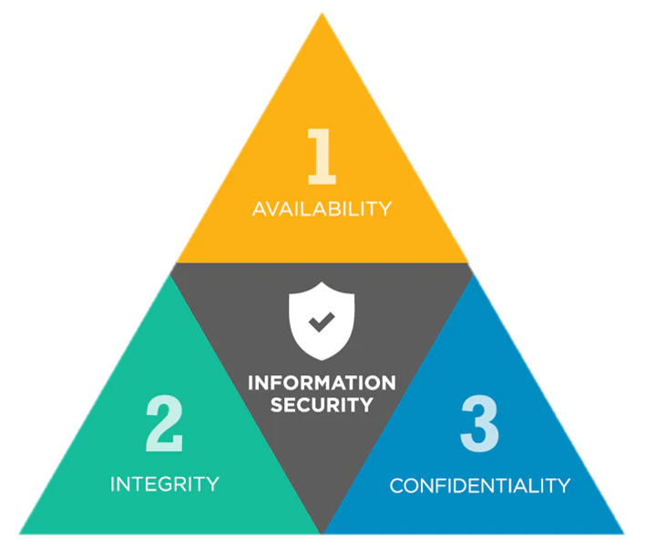

<!-- _class: title -->
# Grundbegriffe

## Die CIA-Triade

---
<!-- _class: biglist -->
# Agenda

- **Angreifer und Ziele**
- **Was ist die CIA-Triade?** - Definition der Kernkonzepte.
- **C: Vertraulichkeit (Confidentiality)** - Schutz vor unbefugtem Lesen.
- **I: Integrität (Integrity)** - Schutz vor unbefugtem Ändern.
- **A: Verfügbarkeit (Availability)** - Sicherstellung des Zugriffs.
- **Die Erweiterungen** - Authentizität & Zurechenbarkeit.
- **Zusammenfassung** - Alle Konzepte im Überblick.

---
# Wer sind die Angreifer? (Akteursgruppen)

- **Cyberkriminelle**  
  - Organisierte Banden, Ransomware-Gruppen, Betrüger  
  - Hauptmotivation: Geld, oft hochprofessionell

- **Staaten / staatliche Akteure**  
  - Geheimdienste, Militär, staatlich unterstützte Gruppen (APTs)  
  - Motivation: Spionage, Sabotage, geopolitischer Einfluss

- **Hacktivisten**  
  - Lose Gruppierungen mit politischer/ideologischer Agenda  
  - Motivation: Aufmerksamkeit, Protest, „Bestrafung“ von Organisationen

---
# Wer sind die Angreifer? (Akteursgruppen)

- **Insider**  
  - Mitarbeitende, Ex-Mitarbeitende, Dienstleister  
  - Motivation: Rache, persönliche Konflikte, Geld, Überzeugungen

- **Script Kiddies / lernende Angreifer** 
  - Nutzen fertige Tools und Exploits ohne tiefes Verständnis  
  - Motivation: Spaß, Anerkennung, „mal sehen, ob es geht“

- **Wettbewerber** 
  - (Selten offen, eher über Dritte)  
  - Motivation: Wirtschaftsspionage, Markt- und Wettbewerbsvorteile

---
# Warum werden IT-Systeme angegriffen? (Ziele)

- **Finanzielle Ziele**  
  - Diebstahl von Geld (Online-Banking, Krypto), Erpressung (Ransomware)  
  - Verkauf von Daten (Kreditkarten, Zugangsdaten)

- **Informationsgewinn**  
  - Wirtschaftsspionage, Know-how-Diebstahl  
  - Abgriff von personenbezogenen Daten (Profiling, Identitätsdiebstahl)

- **Sabotage & Störung**  
  - Lahmlegen von Diensten (DDoS), Produktionsausfälle  
  - Zerstörung von Daten oder Systemen

---
# Warum werden IT-Systeme angegriffen? (Ziele)

- **Politische / ideologische Ziele**  
  - Protest („Hacktivism“), Einflussnahme, Desinformation  
  - Zensur umgehen oder durchsetzen

- **Macht & Kontrolle**  
  - Aufbau von Botnetzen, Hintertüren, langfristiger Zugriff („Persistence“)

- **Prestige & Neugier**  
  - „Proof of Concept“, Reputationsaufbau in der Szene  
  - Technische Herausforderung, Spieltrieb

---
# Die CIA-Triade – Übersicht

- **Confidentiality (Vertraulichkeit):** Schutz vor unbefugtem Zugriff.  
- **Integrity (Integrität):** Schutz vor unbefugter Änderung.  
- **Availability (Verfügbarkeit):** Gewährleistung des Zugriffs.

---
<!-- _class: chapter -->

# Confidentiality

## Vertraulichkeit

---
# C: Überblick

- **Ziel:**  
  - Schutz vor unbefugter Offenlegung – Nur autorisierte Personen dürfen auf Informationen zugreifen.

- **Maßnahmen:**  
  - Verschlüsselung  
  - Zugriffskontrollen  
  - Physische Maßnahmen

- **Verletzung:**  
  - Datenleck (Data Breach), Spionage.

---
# C: Verschlüsselung

- **Data in Transit (Übertragung):**  
  - Schützt Daten beim Senden über Netzwerke (z.B. Internet).  
  - Beispiele: TLS/SSL (HTTPS), VPNs.  
  - Verhindert "Sniffing" (Abhören).

- **Data at Rest (Speicherung):**  
  - Schützt Daten auf Festplatten, Servern, Backups.  
  - Beispiele: AES, BitLocker.  
  - Schützt bei physischem Diebstahl.

---
# C: Zugriffskontrolle

- **Authentifizierung: Wer bist du?**  
  - Nachweis der Identität.  
  - Beispiele: Passwort, Multi-Faktor-Authentifizierung (MFA), Biometrie.

- **Autorisierung: Was darfst du?**  
  - Zuweisung von Rechten nach der Identifizierung.  
  - Least Privilege Principle: Nur die minimal notwendigen Rechte vergeben.

---
# C: Information Hiding

- **Steganographie:**  
  - Verbergen von Daten in scheinbar unschuldigen Objekten (wie Bildern oder Audiodateien).

- **Data Masking / Anonymisierung:**  
  - Ersetzen sensibler Daten durch unkritische Platzhalter (z.B. in Testumgebungen).  
  - Keine Produktionsdaten auf Staging-Umgebungen!

---
# C: Bedrohungen

- **Sniffing / Eavesdropping**  
  - Abhören des Netzwerkverkehrs (z.B. in öffentlichen WLANs), um unverschlüsselte Daten mitzulesen.

- **Social Engineering**  
  - Psychologische Manipulation von Personen (z.B. Phishing), um vertrauliche Informationen zu erlangen.

- **Physischer Diebstahl**  
  - Entwendung von Geräten mit unverschlüsselten sensiblen Daten.

---
<!-- _class: chapter -->

# Integrity

## Integrität

---
# I: Überblick

- Integrität stellt sicher, dass Informationen **korrekt, vollständig, konsistent und unverändert** sind.
- Schutz vor unbefugtem oder unbeabsichtigtem **Ändern** von Daten und Systemen.

- **Kernanforderungen:**  
  - Korrektheit (Accuracy) - Sachliche Richtigkeit
  - Vollständigkeit (Completeness) - Alle notwendigen Daten sind vorhanden
  - Konsistenz (Consistency) - Daten wiedersprechen sich nicht
  - Unverändertheit (Unmodified) - Änderungen müssen autorisiert sein

---
# I: Mechanismen: Hashing & Signaturen

- **Hash-Funktionen (Prüfsummen)**  
  - Erzeugen eindeutigen Fingerabdruck (z.B. SHA-256). 
  - Ändert sich auch nur ein Bit in den Daten, ändert sich der Hash-Wert komplett. 
  - Anwendung: Passwortsicherung, Datei-Download-Prüfung.

- **Digitale Signaturen**  
  - Kombination aus Hashing + asymmetrischer Kryptografie.  
  - Beweist Integrität & Authentizität.  
  - Anwendung: sichere E-Mails, Software-Signierung.

---
# I: Mechanismen: Kontrolle & Transaktionen

- **Schreib-Zugriffskontrolle**
  Definiert präzise, WER Daten ändern, erstellen oder löschen darf (Autorisierung).  
- **Eingabevalidierung**
  Stellt sicher, dass nur korrekte und gültige Daten (z.B. Zahlen in einem Preisfeld) verarbeitet werden.
- **Transaktionsintegrität (ACID)**  
  Garantiert bei Datenbanken, dass Operationen (z.B. eine Überweisung) entweder GANZ oder GAR NICHT ausgeführt werden. Verhindert inkonsistente Daten.
- **Versionskontrolle & Logging**
  Protokolliert JEDE Änderung, um sie nachvollziehbar zu machen.

---
# I: Bedrohungen

- **Datenmanipulation**  
  Ein Angreifer ändert gezielt Daten, z.B. Kontostände in einer Bankdatenbank, Noten in einem Universitätssystem oder Einträge in Log-Dateien.
- **Malware**  
  Viren oder Ransomware, die Daten beschädigen, löschen oder unbemerkt verändern, bevor sie verschlüsselt werden.
- **Menschliches Versagen**
  Ein autorisierter Benutzer macht einen Fehler und gibt falsche Daten ein oder löscht versehentlich wichtige Datensätze.
  

---
<!-- _class: chapter -->
# Availability

## Verfügbarkeit

---
# A: Verfügbarkeit

- **Ziel:** Sicherstellung des Zugriffs bei Bedarf.  
- Autorisierte Benutzer müssen auf Systeme und Daten zugreifen können.
- **Maßnahmen:**  
  - Redundanz (z.B. RAID, Cluster)  
  - Backups & Disaster Recovery  
  - Schutz vor DDoS-Angriffen  
- **Verletzung:**  
  - Systemausfall  
  - Denial of Service (DoS)

---
# Ein Balanceakt

Die drei **Schutzziele** stehen oft in Konkurrenz.  

**Beispiel:** Maximale Vertraulichkeit (z.B. Offline-Speicherung im Safe) kann die Verfügbarkeit drastisch einschränken.

---
<!-- _class: chapter -->

# Erweiterungen der Triade

## Weitere Schutzziele

---
# Erweiterung: Authentizität (Echtheit) 

- Stellt sicher, dass die Identität eines Benutzers oder Systems zweifelsfrei überprüft wird.
- Frage: „Bist du wirklich der, für den du dich ausgibst?“

- **Maßnahmen:**  
  - Passwörter & PINs  
  - Multi-Faktor-Authentifizierung (MFA)  
  - Biometrie  
  - Digitale Zertifikate

---
# Erweiterung: Zurechenbarkeit

- Zurechenbarkeit (Nicht-Abstreitbarkeit)  
- Verhindert, dass ein Absender das Senden einer Nachricht oder das Ausführen einer Transaktion nachträglich leugnen kann.
- Ziel: Schaffung von Beweiskraft.

- **Maßnahmen:**  
  - Digitale Signaturen  
  - Revisionssichere Protokollierung (Logging)  
  - Zeitstempel-Dienste

---
# Zusammenfassung

- **Die Kern-Triade (CIA)**  
  - Vertraulichkeit: Schutz vor unbefugtem LESEN.  
  - Integrität: Schutz vor unbefugtem ÄNDERN.  
  - Verfügbarkeit: Schutz vor unbefugtem NICHT-ZUGRIFF.

- **Die Erweiterungen**  
  - Authentizität: Beweis der ECHTHEIT einer Identität.  
  - Zurechenbarkeit: Beweis einer HANDLUNG (Nicht-Abstreitbarkeit).
