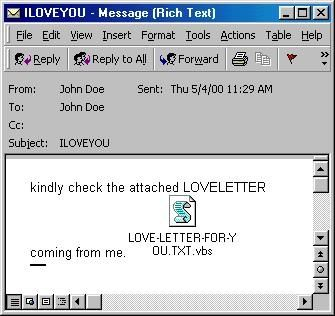

<!-- _class: title -->
# I Love You  
## Der Urknall der IT-Sicherheit

---

# VBS.LoveLetter.A
<!-- _class: biglist -->
- Datum: 4. Mai 2000
- Typ: Computerwurm (VBScript)
- Schaden: geschätzt 5,5 – 10 Mrd. USD
- Infektion: ca. 10% aller internetfähigen Rechner weltweit
- Datei: LOVE-LETTER-FOR-YOU.TXT.vbs

---

# Der Kontext (Die Umgebung)

**Betriebssysteme:**
- Windows 98 und Windows 2000

**Windows Script Host (WSH):**
- Tief im System integriert
- .vbs Dateien standardmäßig ausführbar
- Keine Sandbox (Vollzugriff)

**Design-Entscheidung:**
- „Erweiterungen bei bekannten Dateitypen ausblenden“
- Aus LOVE-LETTER-FOR-YOU.TXT.vbs wurde LOVE-LETTER-FOR-YOU.TXT

---

# So sah die Mail aus…

<style scoped>
p { text-align: center; }
</style>



---

# Schritt 1 – Persistenz

**Code-Snippet (VBS):**
```vbscript
Set fso = CreateObject("Scripting.FileSystemObject")
wscr.RegWrite "HKLM\\...\\Run\\MSKernel32",...
```
<br>

**Dateisystem-Kopien (Tarnung):**
- MSKernel32.vbs (System32)
- Win32DLL.vbs (Windows Dir)

---

# Schritt 1 – Persistenz

**Registry Autostart:**
- HKLM\Software\Microsoft\Windows\CurrentVersion\Run
  
<br> 

**Payload-Download:**
- Versuch, WIN-BUGSFIX.exe (Trojaner) nachzuladen.

---

# Schritt 2 – Verbreitung

**Code-Snippet:**
```vbscript
Set out = CreateObject("Outlook.Application")
Set mapi = out.GetNameSpace("MAPI")
For ctrlists = 1 To mapi.AddressLists.Count
' Sende Mail an JEDEN Eintrag im Adressbuch
Next
```

**Schneeballsystem:**
- Zugriff auf Globales Adressbuch (GAL) in Firmen.
- Exponentielles Wachstum.

**Folge:**
- Mail-Server (Exchange) brachen weltweit unter der Last zusammen.

---

# Schritt 3 – Zerstörung

**Überschrieben & Umbenannt (in .vbs):**
- Bilder: .jpg, .jpeg
- Skripte: .js, .css, .vbs

**Versteckt (Hidden Attribute):**
- Musik: .mp3, .mp2

**Auswirkung:**
- Massiver Datenverlust (unwiederbringlich ohne Backup).
- Urlaubsfotos → Code des Wurms.
- MP3s → Wurde durch Klick auf „Fake-MP3“ erneut ausgeführt.

---

# Täter & Motivation

- Autor: Onel de Guzman (24), Student am AMA Computer College, Manila.
- Thesis-Proposal: "E-mail Password Sender Trojan"
- Ziel: Stehlen von Internet-Zugangsdaten, um „armen Studenten“ kostenlosen Zugang zu ermöglichen.

**Reaktion der Fakultät:**
- Ablehnung: „We do not produce burglars“

**Motivation:**
- Frust
- Jugendlicher Übermut

---

# Rechtliche Folgen

**Ermittlung:**
- Schnelle Rückverfolgung nach Manila durch FBI/NBI.

<br>

**Problem:**
- Keine Cybercrime-Gesetze in den Philippinen (Stand Mai 2000).
- Kein Diebstahl (nichts Physisches weg).
- Keine Sachbeschädigung (Hardware intakt).
  
---

# Rechtliche Folgen

**Urteil:**
- Anklage fallen gelassen (Nulla poena sine lege).

<br>

**Folge:**
- „Republic Act 8792“ (E-Commerce Law) wurde im Juli 2000 verabschiedet (zu spät für diesen Fall).

---
<!-- _class: biglist -->
# Fazit & Lehren

- **Secure by Default:** Systeme dürfen unsichere Aktionen (Skripte ausführen) nicht standardmäßig erlauben.
- **UI Design ist Security:** Dateiendungen auszublenden ist gefährlich.
- **Legacy Code:** Offene Schnittstellen (wie das alte Outlook Object Model) sind Zeitbomben.
- **Awareness:** Technische Sicherheit versagt, wenn der Nutzer emotional manipuliert wird („ILOVEYOU“).
